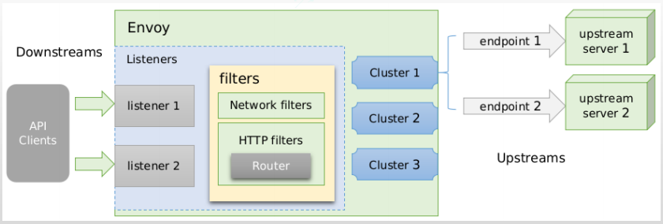
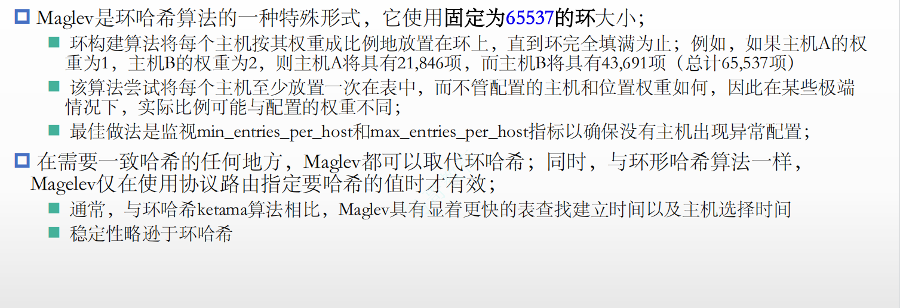
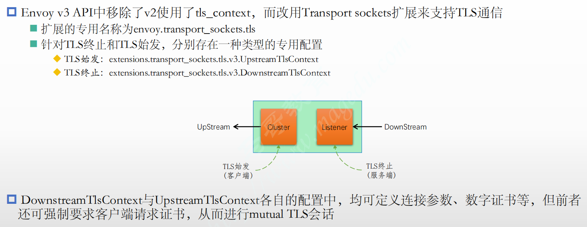

## Envoy基础组件

实现高级网络功能的代理服务，可以以sidecar方式运行，在workload的旁边运行一个实例，只代理到workload的正向请求或者出workload反向请求

还可以单独运行一个Front Proxy 代理到各个sidecar envoy

若在app service之前的则是Ingress Listener ，在app service之后则是Egress Listener,真正通信的envoy实例

在Envoy中listeners负责监听套接字，客户端就可以与envoy建立连接，但是数据报文进来之后，要通过filter chains过滤器链来拼装一系列的过滤器来处理，过滤器链是定义在侦听器之上的,过滤器链中还指明了请求可以被哪个cluster所处理

cluster manger可以将用来处理客户端请求的上游服务器归并成组, management server 可以是配置中心，cluster manger或者侦听器管理器可以向managent server获取数据，动态的生成集群,他们之间所使用的协议就是xDS

Envoy提供了一组可以由控制平面服务实现的管理API 称之为xDS API

在envoy的定义中每一个Endpoint对应一个server，通过EDS发现的每一个server,映射进envoy内部来就叫做一个Endpoint，属于同一个组的Endpoint即是一个cluster

## Envoy配置概述

动态配置：

1）xDS API 

 从配置文件中加载

从管理服务器（Management Server）基于xds协议加载配置

2）envoy还有一个runtime的组件，内部提供了一些开关，可以设置属性值（kv格式）

Bootstrap配置文件

{

"node": "{...}",              区别于其他节点的标识符

"static_resources": "{...}",

"dynamic_resources": "{...}",

"cluster_manager": "{...}",

"hds_config": "{...}",   使用HDS从管理服务器加载上游主机健康状态检测相关的配置

"flags_path": "...",

"stats_sinks": [],

"stats_config": "{...}",

"stats_flush_interval": "{...}",

"stats_flush_on_admin": "...",

"watchdog": "{...}",

"watchdogs": "{...}",

"tracing": "{...}",                    分布式跟踪

"layered_runtime": "{...}",

"admin": "{...}",    内置的管理接口，统计数据，调整配置

"overload_manager": "{...}",

"enable_dispatcher_stats": "...",

"header_prefix": "...",

"stats_server_version_override": "{...}",

"use_tcp_for_dns_lookups": "...",

"bootstrap_extensions": [],

"fatal_actions": [],

"default_socket_interface": "..."

}

## 侦听器和集群的配置



Enovy支持TCP和UDP两种类型的侦听器，有自己独立的过滤器

过滤器有两类：

L3/L4过滤器

L7必须在其中三四层的基础上实现

Enovy内置了许多L3/L4过滤器，例如

◼代理类：TCP Proxy、**HTTP connection manager**、Thrift Proxy、Mongo proxy、Dubbo Proxy、

ZooKeeper proxy、MySQL proxy和Redis proxy等，

◼其它：Client TLS authentication、Rate limit、Role Based Access Control (RBAC) Network Filter

和Upstream Cluster from SNI等

 HTTP connection manager

◼ HTTP connection manager自身是L3/L4过路器，它能够将原始字节转换为HTTP级别消息

和事件（例如，headers和body等）

◼ 它还处理所有HTTP连接和请求共有的功能，例如访问日志记录、请求ID生成和跟踪、

请求/响应头操作、路由表管理和统计信息等；

◼ 与L3/L4过滤器堆栈相似，Envoy还支持在HTTP连接管理器中使用HTTP级过滤器堆栈；

​      ◆ HTTP过滤器在L7运行，它们访问和操作HTTP请求和响应；例如，gRPC-JSON Transcoder Filter为

​          gRPC后端公开REST API，并将请求和响应转换为相应的格式；

​      ◆ 常用的HTTP过路器有Router、Rate limit、Health check、Gzip和Fault Injection等；


Upstream clusters

◼ 由集群管理器负责管理的各集群可以由用户静态配置，也可借助于CDS API动态获取；

◼集群中的每个成员由endpoint进行标识，它可由用户静态配置，也可通过EDS或DNS服务

动态发现；

​    ◆ Static：静态配置

​    ◆ Strict DNS：严格DNS，Envoy将持续和异步地解析指定的DNS目标，并将DNS结果中的返回的每

​        个IP地址视为上游集群中可用端点，是可变的；

​    ◆ Logical DNS：逻辑DNS，集群仅使用在需要启动新连接时返回的第一个IP地址，而非严格获取

​         DNS查询的结果并假设它们构成整个上游集群；适用于必须通过DNS访问的大规模Web服务集群；

​    ◆ Original destination：当传入连接通过iptables的REDIRECT或TPROXY target或使用代理协议重定向

​        到Envoy时，可以使用原始目标集群；

​    ◆ Endpoint discovery service (EDS)：EDS是一种基于GRPC或REST-JSON API的xDS管理服务器获取集

​         群成员的服务发现方式；

​    ◆ Custom cluster：Envoy还支持在集群配置上的cluster_type字段中指定使用自定义集群发现机制；

Envoy连接处理


Cluster简易静态配置

lb_policy: # 负载均衡算法，支持ROUND_ROBIN、LEAST_REQUEST（最好连接）、RING_HASH（哈希环）、RANDOM（随机）、MAGLEV 和CLUSTER_PROVIDED还有更高级的算法

```yaml
clusters:
- name: local_cluster
  connect_timeout: 0.25s
  type: STATIC
  lb_policy: ROUND_ROBIN
  load_assignment:
    cluster_name: local_cluster
    endpoints:
    - lb_endpoints:
      - endpoint:
          address:
            socket_address: { address: 127.0.0.1, port_value: 8080 }
```

L4过滤器tcp_proxy

 TCP代理过滤器在下游客户端及上游集群之间执行1:1网络连接代理

  ◼ 它可以单独用作隧道替换，也可以同其他过滤器（如MongoDB过滤器或速率限制过滤器）结合使用； 

  ◼ TCP代理过滤器严格执行由全局资源管理于为每个上游集群的全局资源管理器设定的连接限制

​      ◆ TCP代理过滤器检查上游集群的资源管理器是否可以在不超过该集群的最大连接数的情况下创建连接； 

  ◼ TCP代理过滤器可直接将请求路由至指定的集群，也能够在多个目标集群间基于权重进行调度转发；

 配置语法：

```json
{
"stat_prefix": "...", # 用于统计数据中输出时使用的前缀字符；
"cluster": "...", # 路由到的目标集群标识；
"weighted_clusters": "{...}",
"metadata_match": "{...}",
"idle_timeout": "{...}", # 上下游连接间的超时时长，即没有发送和接收报文的超时时长；
"access_log": [], # 访问日志；
"max_connect_attempts": "{...}" # 最大连接尝试次数；
}
```

例子

```yaml
static_resources:
  listeners:
    name: listener_0
    address:
      socket_address: { address: 0.0.0.0, port_value: 80 }
    filter_chains:
    - filters:
      - name: envoy.tcp_proxy
        typed_config:
          "@type": type.googleapis.com/envoy.extensions.filters.network.tcp_proxy.v3.TcpProxy
          stat_prefix: tcp
          cluster: local_cluster

  clusters:
  - name: local_cluster
    connect_timeout: 0.25s
    type: STATIC
    lb_policy: ROUND_ROBIN
    load_assignment:
      cluster_name: local_cluster
      endpoints:
      - lb_endpoints:
        - endpoint:
            address:
              socket_address: { address: 172.31.1.11, port_value: 8080 }
        - endpoint:
            address:
              socket_address: { address: 172.31.1.12, port_value: 8080 }

```

L4过滤器http_connection_manager


```yaml
static_resources:
  listeners:
  - name: listener_0
    address:
      socket_address: { address: 0.0.0.0, port_value: 80 }
    filter_chains:
    - filters:
      - name: envoy.filters.network.http_connection_manager
        typed_config:
          "@type": type.googleapis.com/envoy.extensions.filters.network.http_connection_manager.v3.HttpConnectionManager
          stat_prefix: ingress_http
          codec_type: AUTO
          route_config:
            name: local_route
            virtual_hosts:
            - name: web_service_1
              domains: ["*"]
              routes:
              - match: { prefix: "/" }
                route: { cluster: local_cluster }
          http_filters:
          - name: envoy.filters.http.router

  clusters:
  - name: local_cluster
    connect_timeout: 0.25s
    type: STATIC
    lb_policy: ROUND_ROBIN
    load_assignment:
      cluster_name: local_cluster
      endpoints:
      - lb_endpoints:
        - endpoint:
            address:
              socket_address: { address: 127.0.0.1, port_value: 8080 }

```

## Administration interface和Layered Runtime基础


```yaml
layers:
- name: static_layer_0
  static_layer:
    health_check:
      min_interval: 5
- name: disk_layer_0
  disk_layer: { symlink_root: /srv/runtime/current, subdirectory: envoy }
- name: disk_layer_1
  disk_layer: { symlink_root: /srv/runtime/current, subdirectory: envoy_override, append_service_cluster: true }
- name: admin_layer_0
  admin_layer: {}  #通过这个layer调整参数
```

```yaml
layered_runtime:
  layers:
  - name: admin
    admin_layer: {}
....
virtual_hosts:
- name: demoapp
  domains: ["*"]
  routes:
  routes:
  - match:
      prefix: "/"
    route:
      weighted_clusters:
        clusters:
        - name: demoappv10
          weight: 100
        - name: demoappv11
          weight: 0
        total_weight: 100
        runtime_key_prefix: routing.traffic_split.demoapp   #通过修改这个键的值动态指定流量分割的比例
```

## Front Proxy and TLS

◼ Front Proxy面向下游客户端提供https服务，但Front Proxy, Mesh内部的各服务间依然使用http协议,相当于是TLS的卸载器

  ◆ https → http

◼ Front Proxy面向下游客户端提供https服务，而且Mesh内部的各服务间也使用https协议

  ◆ https → https{重新建立的第二级的TLS连接，还可以将Front Proxy做为四层代理，但是面向客户端的TLS会话不卸载，直接透传到upstram的service,但Envoy       

​      Mesh中各Service需要基于tls提供服务}

  ◆ 但是内部各Service间的通信也有如下两种情形

​      ⚫ 仅客户端验证服务端证书

​      ⚫ 客户端与服务端之间互相验证彼此的证书（mTLS） 

  ◆ 注意：对于容器化的动态环境来说，证书预配和管理将成为显著难题

◼ 与DownStream通信需要配置在Listener

  ◆我们需要提供certs，私钥给客户端（客户端用服务器端发的公钥加密选择的会话密钥匙，发给服务器端，服务器端用私钥解密）

  ◆Server Cert

◼ 与UpStream通信需要配置在Cluster

   ◆Client (CA Certs),如果是双向的话还需要Client Cert 和私钥

1）TLS Front Proxy https → http

  

 证书的位置可以通过sds来自动生成

2）Upstream and downstream TLS      https-->https(单向TLS)

比1）中多了一项tls的配置

3)Front Proxy https passthrough


在这里的意义只是为了实现envoy其他的高级功能，后端其实还需要加一个代理服务器

总：Front Proxy代理至上游其中的三个服务时，他们之间是http通信，此时Front Proxy只需要提面向客户端的服务端证书

​        Front Proxy代理至上游其中的一个服务时，他们要做tls的单向通信，此时Front Proxy只需要一个ca cert 来验证上游的服务

​        Front Proxy代理至上游其中的一个服务时，他们要做tls的双向通信，此时还的另外需要一个客户端证书，用来与上游服务器进行双向通信

那么我们就需要一个证书颁发机构来颁发（Front Proxy作为服务端必须使用公信的CA,其他认证的方式可以使用自建CA）

创建出来的证书私钥需要变更为envoy用户的uid gid chown -R 100.101 ./*

## xDS API 与动态配置

每一个Pod前端的sidecar engress listener更重要，因为正向代理至后端app的服务被认为是由sidecar提供的 

xDS API可以理解为发现协议和资源规范

有三种类型的服务发现机制

◼ 基于文件系统发现：指定要监视的文件系统路径

◼ 通过查询一到多个管理服务器（Management Server）发现：通过DiscoveryRequest协议报文发送请

求，并要求服务方以DiscoveryResponse协议报文进行响应

​    ◆ gRPC服务：启动gRPC流 

​    ◆ REST服务：轮询REST-JSON URL

部分更高级别的操作（例如执行服务的A/B部署）需要进行排序以防止流量被丢弃，因此，基于一个管理服

务器提供多类API时还需要使用聚合发现服务（**ADS**）API

#### Bootstrap node 配置段

Envoy实例请求发现配置时，需要在请求报文中上报自身的信息

​    ◆ 例如id、cluster、metadata和locality等 

​    ◆ 这些配置信息定义在Bootstrap配置文件中

```yaml
node:
  id: … # An opaque node identifier for the Envoy node. 
  cluster: … # Defines the local service cluster name where Envoy is running. 
  metadata: {…} # Opaque metadata extending the node identifier. Envoy will pass this directly to the management server.
  locality: # Locality specifying where the Envoy instance is running.
    region: …
    zone: …
    sub_zone: …
  user_agent_name: … # Free-form string that identifies the entity requesting config. E.g. “envoy” or “grpc”
  user_agent_version: … # Free-form string that identifies the version of the entity requesting config. E.g. “1.12.2” or “abcd1234” , or “SpecialEnvoyBuild”
  user_agent_build_version: # Structured version of the entity requesting config.
    version: …
    metadata: {…}
extensions: [ ] # List of extensions and their versions supported by the node.
client_features: [ ]
listening_addresses: [ ] # Known listening ports on the node as a generic hint to the management server for filtering listeners to be returned.
```

#### Envoy资源的配置源


##### 基于文件系统的订阅

```yaml
node:
  id: envoy_front_proxy
  cluster: MageEdu_Cluster

admin:
  profile_path: /tmp/envoy.prof
  access_log_path: /tmp/admin_access.log
  address:
    socket_address:
       address: 0.0.0.0
       port_value: 9901

static_resources:
  listeners:
  - name: listener_0
    address:
      socket_address: { address: 0.0.0.0, port_value: 80 }
    filter_chains:
    - filters:
      - name: envoy.filters.network.http_connection_manager
        typed_config:
          "@type": type.googleapis.com/envoy.extensions.filters.network.http_connection_manager.v3.HttpConnectionManager
          stat_prefix: ingress_http
          codec_type: AUTO
          route_config:
            name: local_route
            virtual_hosts:
            - name: web_service_01
              domains: ["*"]
              routes:
              - match: { prefix: "/" }
                route: { cluster: webcluster }
          http_filters:
          - name: envoy.filters.http.router

  clusters:
  - name: webcluster
    connect_timeout: 0.25s
    type: EDS
    lb_policy: ROUND_ROBIN
    eds_cluster_config:
      service_name: webcluster
      eds_config:
        path: '/etc/envoy/eds.conf.d/eds.yaml'

```

```yaml
resources:
- "@type": type.googleapis.com/envoy.config.endpoint.v3.ClusterLoadAssignment
  cluster_name: webcluster
  endpoints:
  - lb_endpoints:
    - endpoint:
        address:
          socket_address:
            address: 172.31.11.11
            port_value: 80

```

##### grpc订阅

```yaml
node:
  id: envoy_front_proxy
  cluster: webcluster

admin:
  profile_path: /tmp/envoy.prof
  access_log_path: /tmp/admin_access.log
  address:
    socket_address:
       address: 0.0.0.0
       port_value: 9901

dynamic_resources:
  lds_config:
    resource_api_version: V3
    api_config_source:
      api_type: GRPC
      transport_api_version: V3
      grpc_services:
      - envoy_grpc:
          cluster_name: xds_cluster

  cds_config:
    resource_api_version: V3
    api_config_source:
      api_type: GRPC
      transport_api_version: V3
      grpc_services:
      - envoy_grpc:
          cluster_name: xds_cluster

static_resources:
  clusters:
  - name: xds_cluster
    connect_timeout: 0.25s
    type: STRICT_DNS
    # The extension_protocol_options field is used to provide extension-specific protocol options for upstream connections. 
    typed_extension_protocol_options:
      envoy.extensions.upstreams.http.v3.HttpProtocolOptions:
        "@type": type.googleapis.com/envoy.extensions.upstreams.http.v3.HttpProtocolOptions
        explicit_http_config:
          http2_protocol_options: {}
    lb_policy: ROUND_ROBIN
    load_assignment:
      cluster_name: xds_cluster
      endpoints:
      - lb_endpoints:
        - endpoint:
            address:
              socket_address:
                address: xdsserver
                port_value: 18000

```

```yaml
node:
  id: envoy_front_proxy
  cluster: webcluster

admin:
  profile_path: /tmp/envoy.prof
  access_log_path: /tmp/admin_access.log
  address:
    socket_address:
       address: 0.0.0.0
       port_value: 9901

dynamic_resources:
  ads_config:
    api_type: GRPC
    transport_api_version: V3
    grpc_services:
    - envoy_grpc:
        cluster_name: xds_cluster
    set_node_on_first_message_only: true
  cds_config:
    resource_api_version: V3
    ads: {}
  lds_config:
    resource_api_version: V3
    ads: {}

static_resources:
  clusters:
  - name: xds_cluster
    connect_timeout: 0.25s
    type: STRICT_DNS
    # The extension_protocol_options field is used to provide extension-specific protocol options for upstream connections. 
    typed_extension_protocol_options:
      envoy.extensions.upstreams.http.v3.HttpProtocolOptions:
        "@type": type.googleapis.com/envoy.extensions.upstreams.http.v3.HttpProtocolOptions
        explicit_http_config:
          http2_protocol_options: {}
    lb_policy: ROUND_ROBIN
    load_assignment:
      cluster_name: xds_cluster
      endpoints:
      - lb_endpoints:
        - endpoint:
            address:
              socket_address:
                address: xdsserver
                port_value: 18000

```

##### Rest-Json轮询订阅

## 集群管理

某一个集群有两个Locality构成，每一个locality有很多端点

1)我们可以在locality上定义一个 priority优先级别，表示前端引入的流量只到这个优先级Locality构成的端点集群，还可以在集群级别加一个超配因子overprovisioning_factor表示，原本在locality1的流量，由于端点故障可以使其一小部分流量到licality2

2）各个locality上的 priority优先级是相同的，但是他们配置了位置加权负载均衡，表示流量可以在多个Locality中调度，但是同样可以在集群级别设置超配因子

#### 故障处理机制

 Envoy提供了一系列开箱即用的故障处理机制

   前端路由实现的

   ◼ 超时(timeout)

   ◼ 有限次数的重试，并支持可变的重试延迟

   集群实现   

   ◼ 主动健康检查与异常探测

   ◼ 连接池

   ◼ 断路器

 所有这些特性，都可以在运行时动态配置；

 结合流量管理机制，用户可为每个服务/版本定制所需的故障恢复机制；

##### Upstreams 健康状态检测

 健康状态检测用于确保代理服务器不会将下游客户端的请求代理至工作异常的上游主机；

 Envoy支持两种类型的健康状态检测，二者均基于集群进行定义

  ◼ 主动检测（

  Active Health Checking）：Envoy周期性地发送探测报文至上游主机，并根据其响应判断其 健康状态；Envoy目前支持三种类型的主动检测：

​    ◆ HTTP：向上游主机发送HTTP请求报文

​    ◆ L3/L4：向上游主机发送L3/L4请求报文，基于响应的结果判定其健康状态，或仅通过连接状态进行判定；

​    ◆ Redis：向上游的redis服务器发送Redis PING ； 

  ◼ 被动检测（Passive Health Checking）：Envoy通过异常检测（Outlier Detection）机制进行被动模式的健 康状态检测；

​    ◆ 目前，仅http router、tcp proxy和redis proxy三个过滤器支持异常值检测；

​    ◆ Envoy支持以下类型的异常检测

​       ⚫ 连续5XX：意指所有类型的错误，非http router过滤器生成的错误也会在内部映射为5xx错误代码；

​       ⚫ 连续网关故障：连续5XX的子集，单纯用于http的502、503或504错误，即网关故障；

​       ⚫ 连续的本地原因故障：Envoy无法连接到上游主机或与上游主机的通信被反复中断；   

​       ⚫ 成功率：主机的聚合成功率数据阈值；

###### 主动健康状态监测


###### 异常值探测


#### 负载均衡策略

##### 配置参数


#### Envoy的负载均衡算法

 Cluster Manager使用负载均衡策略将下游请求调度至选中的上游主机，它支持如下几个算法

   ◼ 加权轮询（weighted round robin）：算法名称为ROUND_ROBIN

   ◼ 加权最少请求（weighted least request）：算法名称为LEAST_REQUEST

   ◼ 环哈希（ring hash）：算法名称为RING_HASH，其工作方式类似于一致性哈希算法；

   ◼ 磁悬浮（maglev）：类似于环哈希，但其大小固定为65537，并需要各主机映射的节点填满整个环；无论配置的主机和位置权重如何，算法都会尝试确保将每 

​       个主机至少映射一次；算法名称为MAGLEV

   ◼ 随机（random）：未配置健康检查策略，则随机负载均衡算法通常比轮询更好；

 另外，还有原始目标集群负载均衡机制，其算法为ORIGINAL_DST_LB，但仅适用于原始目标集群的调度；

###### 加权最少请求


###### 环哈希


###### 路由哈希


```yaml
admin:
  profile_path: /tmp/envoy.prof
  access_log_path: /tmp/admin_access.log
  address:
    socket_address: { address: 0.0.0.0, port_value: 9901 }

static_resources:
  listeners:
  - name: listener_0
    address:
      socket_address: { address: 0.0.0.0, port_value: 80 }
    filter_chains:
    - filters:
      - name: envoy.filters.network.http_connection_manager
        typed_config:
          "@type": type.googleapis.com/envoy.extensions.filters.network.http_connection_manager.v3.HttpConnectionManager
          stat_prefix: ingress_http
          codec_type: AUTO
          route_config:
            name: local_route
            virtual_hosts:
            - name: webservice
              domains: ["*"]
              routes:
              - match: { prefix: "/" }
                route:
                  cluster: web_cluster_01
                  hash_policy:
                  # - connection_properties:
                  #     source_ip: true
                  - header:
                      header_name: User-Agent
          http_filters:
          - name: envoy.filters.http.router

  clusters:
  - name: web_cluster_01
    connect_timeout: 0.5s
    type: STRICT_DNS
    lb_policy: RING_HASH
    ring_hash_lb_config:
      maximum_ring_size: 1048576
      minimum_ring_size: 512
    load_assignment:
      cluster_name: web_cluster_01
      endpoints:
      - lb_endpoints:
        - endpoint:
            address:
              socket_address:
                address: myservice
                port_value: 80
    health_checks:
    - timeout: 5s
      interval: 10s
      unhealthy_threshold: 2
      healthy_threshold: 2
      http_health_check:
        path: /livez
        expected_statuses:
          start: 200
          end: 399

```


###### 磁悬浮



#### 优先级调度


```yaml
admin:
  access_log_path: "/dev/null"
  address:
    socket_address:
      address: 0.0.0.0
      port_value: 9901

static_resources:
  listeners:
  - address:
      socket_address:
        address: 0.0.0.0
        port_value: 80
    name: listener_http
    filter_chains:
    - filters:
      - name: envoy.filters.network.http_connection_manager
        typed_config:
          "@type": type.googleapis.com/envoy.extensions.filters.network.http_connection_manager.v3.HttpConnectionManager
          codec_type: auto
          stat_prefix: ingress_http
          route_config:
            name: local_route
            virtual_hosts:
            - name: backend
              domains:
              - "*"
              routes:
              - match:
                  prefix: "/"
                route:
                  cluster: webcluster1
          http_filters:
          - name: envoy.filters.http.router

  clusters:
  - name: webcluster1
    connect_timeout: 0.25s
    type: STRICT_DNS
    lb_policy: ROUND_ROBIN
    http2_protocol_options: {}
    load_assignment:
      cluster_name: webcluster1
      policy:
        overprovisioning_factor: 140
      endpoints:
      - locality:
          region: cn-north-1
        priority: 0
        lb_endpoints:
        - endpoint:
            address:
              socket_address:
                address: webservice1
                port_value: 80
      - locality:
          region: cn-north-2
        priority: 1
        lb_endpoints:
        - endpoint:
            address:
              socket_address:
                address: webservice2
                port_value: 80
    health_checks:
    - timeout: 5s
      interval: 10s
      unhealthy_threshold: 2
      healthy_threshold: 1
      http_health_check:
        path: /livez
        expected_statuses:
          start: 200
          end: 399

```

#### 位置加权负载均衡


#### 负载均衡器子集

 Envoy还支持在一个集群中基于子集实现更细粒度的流量分发

   ◼ 首先，在集群的上游主机上添加元数据(键值标签)，并使用子集选择器(分类元数据)将上游主机划分为子集；

   ◼ 而后，在路由配置中指定负载均衡器可以选择的且必须具有匹配的元数据的上游主机，从而实现向特定子集的路由；

   ◼ 各子集内的主机间的负载均衡采用集群定义的策略(lb_policy)； 

 配置了子集，但路由并未指定元数据或不存在与指定元数据匹配的子集时，则子集均衡均衡器为其应用“回退策略” 

   ◼ NO_FALLBACK：请求失败，类似集群中不存在任何主机；此为默认策略；

   ◼ ANY_ENDPOINT：在所有主机间进行调度，不再考虑主机元数据；

   ◼ DEFAULT_SUBSET：调度至默认的子集，该子集需要事先定义；

子集选择器subset_selectors规划后端打了标签的endpoint来创建各个子集，例如一个条件Key (keys: [stage, type])可能引射出多个子集

然后再在路由级别路由至满足条件的子集（还可以定义权重子集）

###### 代码块

```yaml
admin:
  access_log_path: "/dev/null"
  address:
    socket_address: { address: 0.0.0.0, port_value: 9901 }

static_resources:
  listeners:
  - address:
      socket_address: { address: 0.0.0.0, port_value: 80 }
    name: listener_http
    filter_chains:
    - filters:
      - name: envoy.filters.network.http_connection_manager
        typed_config:
          "@type": type.googleapis.com/envoy.extensions.filters.network.http_connection_manager.v3.HttpConnectionManager
          codec_type: auto
          stat_prefix: ingress_http
          route_config:
            name: local_route
            virtual_hosts:
            - name: backend
              domains:
              - "*"
              routes:
              - match:
                  prefix: "/"
                  headers:
                  - name: x-custom-version
                    exact_match: pre-release
                route:
                  cluster: webcluster1
                  metadata_match:
                    filter_metadata:
                      envoy.lb:
                        version: "1.2-pre"
                        stage: "dev"
              - match:
                  prefix: "/"
                  headers:
                  - name: x-hardware-test
                    exact_match: memory
                route:
                  cluster: webcluster1
                  metadata_match:
                    filter_metadata:
                      envoy.lb:
                        type: "bigmem"
                        stage: "prod"
              - match:
                  prefix: "/"
                route:
                  weighted_clusters:
                    clusters:
                    - name: webcluster1
                      weight: 90
                      metadata_match:
                        filter_metadata:
                          envoy.lb:
                            version: "1.0"
                    - name: webcluster1
                      weight: 10
                      metadata_match:
                        filter_metadata:
                          envoy.lb:
                            version: "1.1"
                  metadata_match:
                    filter_metadata:
                      envoy.lb:
                        stage: "prod"
          http_filters:
          - name: envoy.filters.http.router

```

```yaml
clusters:
- name: webclusters
  lb_policy: ROUND_ROBIN
  lb_subset_config:
  fallback_policy: DEFAULT_SUBSET
  default_subset:
    stage: prod
    version: '1.0'
    type: std
  subset_selectors: 
  - keys: [stage, type]
  - keys: [stage, version]
  - keys: [version]
  - keys: [xlarge, version]
```

#### 区域感知路由

发起请求的可能就是sidecar背后的某一个应用，响应的是后端的某一个sidecar，我们的网格是跨区域部署的，响应的一方应该与请求的一方在同一个区域

#### 熔断

多级服务调度用场景中，某上游服务因网络故障或服务繁忙无法响应请求时很可能会导致多级上游调用者大规模级联故障，进而导致整个系统不可用，此即为服务的雪崩效应


##### 连接池个断路器


```yaml
  clusters:
  - name: webcluster1
    connect_timeout: 0.25s
    type: STRICT_DNS
    lb_policy: ROUND_ROBIN
    load_assignment:
      cluster_name: webcluster1
      endpoints:
      - lb_endpoints:
        - endpoint:
            address:
              socket_address:
                address: webservice1
                port_value: 80
    circuit_breakers:
      thresholds:         
        max_connections: 1
        max_pending_requests: 1
        max_retries: 3

  - name: webcluster2
    connect_timeout: 0.25s
    type: STRICT_DNS
    lb_policy: ROUND_ROBIN
    load_assignment:
      cluster_name: webcluster2
      endpoints:
      - lb_endpoints:
        - endpoint:
            address:
              socket_address:
                address: webservice2
                port_value: 80
    outlier_detection:
      interval: "1s"                          #
      consecutive_5xx: "3"                    #连续出现5xx
      consecutive_gateway_failure: "3"        #3次
      base_ejection_time: "10s"               #弹出主机时间长度为10秒
      enforcing_consecutive_gateway_failure: "100"  #    只要出错就弹出
      max_ejection_percent: "30"              #最大弹出比例
      success_rate_minimum_hosts: "2"         #

```

压力测试

fortio load -c 2 -qps 0 -n 20 -loglevel Warning URL
项目地址：https://github.com/fortio/fortio

## HTTP流量管理基础

#### 高级路由

Envoy基于HTTP router过滤器基于路由表完成多种高级路由机制，包括

   ◼ 将域名映射到虚拟主机；

   ◼ path的前缀(prefix)匹配、精确匹配或正则表达式匹配；

   ◼ 虚拟主机级别的TLS重定向；

   ◼ path级别的path/host重定向；

   ◼ 由Envoy直接生成响应报文；

   ◼ 显式host rewrite； 

   ◼ prefix rewrite； 

   ◼ 基于HTTP标头或路由配置的**请求重试**与**请求超时**； 

   ◼ 基于运行时参数的流量迁移；

   ◼ 基于权重或百分比的跨集群流量分割；

   ◼ 基于任意标头匹配路由规则；

   ◼ 基于优先级的路由；

   ◼ 基于hash策略的路由；

   ◼ ... 

##### 配置框架

```yaml
listeners:
- name:
  address: {...}
  filter_chians: []
  - filters:
    - name: envoy.filters.network.http_connection_manager
      typed_config:
        "@type": type.googleapis.com/envoy.extensions.filters.network.http_connection_manager.v3.HttpConnectionManager
        stat_prefix: ingress_http
        codec_type: AUTO
        route_config:
          name: ...
          virutal_hosts: []
          - name: ...
            domains: [] # 虚拟主机的域名，路由匹配时将请求报文中的host标头值与此处列表项进行匹配检测；
            routes: [] # 路由条目，匹配到当前虚拟主机的请求中的path匹配检测将针对各route中由match定义条件进行；
            - name: ...
              match: {...} # 常用内嵌字段 prefix|path|sate_regex|connect_matcher，用于定义基于路径前缀、路径、正则表达式或连接匹配器四者之一定义匹配条件；
              route: {...} # 常用内嵌字段cluster|cluster_header|weighted_clusters，基于集群、请求报文中的集群标头或加权集群（流量分割）定义路由目标；
              redirect: {…} # 重定向请求，但不可与route或direct_response一同使用；
              direct_response: {…} # 直接响应请求，不可与route和redirect一同使用；
            virtual_clusters: [] # 为此虚拟主机定义的用于收集统计信息的虚拟集群列表；
...
...
```

其中  virutal_hosts: []的详细配置为

```json
{
"name": "...",
"domains": [],
"routes": [],
"require_tls": "...",
"virtual_clusters": [],
"rate_limits": [],
"request_headers_to_add": [],
"request_headers_to_remove": [],
"response_headers_to_add": [],
"response_headers_to_remove": [],
"cors": "{...}",
"typed_per_filter_config": "{...}",
"include_request_attempt_count": "...",
"include_attempt_count_in_response": "...",
"retry_policy": "{...}",
"hedge_policy": "{...}",
"per_request_buffer_limit_bytes": "{...}"
}
```

流量选择虚拟主机列表中的其中一个虚拟主机


##### 基于标头的路由匹配


##### 基于查询参数的路由匹配


##### 路由策略

 基础路由配置

   ◼ 在match中简单通过prefix、path或regex指定匹配条件

   ◼ 将匹配到的请求进行重定向、直接响应或路由到指定目标集群

 高级路由策略

   ◼ 在match中通过prefix、path或regex指定匹配条件，并使用高级匹配机制

​      ◆ 结合runtime_fraction按比例切割流量

​      ◆ 结合headers按指定的标头路由，例如基于cookie进行，将其值分组后路由到不同目标；

​      ◆ 结合query_parameters按指定的参数路由，例如基于参数group进行，将其值分组后路由到不同的目标；

​      ◆ 提示：可灵活组合多种条件构建复杂的匹配机制

   ◼ 复杂路由目标

​      ◆ 结合请求报文标头中cluster_header的值进行定向路由

​      ◆ weighted_clusters：将请求根据目标集群权重进行流量分割

​      ◆ 配置高级路由属性，例如重试、超时、CORS、限速等；

```yaml
admin:
  profile_path: /tmp/envoy.prof
  access_log_path: /tmp/admin_access.log
  address:
    socket_address:
       address: 0.0.0.0
       port_value: 9901

static_resources:
  listeners:
  - name: listener_0
    address:
      socket_address: { address: 0.0.0.0, port_value: 80 }
    filter_chains:
    - filters:
      - name: envoy.filters.network.http_connection_manager
        typed_config:
          "@type": type.googleapis.com/envoy.extensions.filters.network.http_connection_manager.v3.HttpConnectionManager
          stat_prefix: ingress_http
          codec_type: AUTO
          route_config:
            name: local_route
            virtual_hosts:
            - name: vh_001
              domains: ["*"]
              routes:
              - match:
                  prefix: "/"
                  headers:
                  - name: X-Canary
                    exact_match: "true"
                route:
                  cluster: demoappv12
              - match:
                  prefix: "/"
                  query_parameters:
                  - name: "username"
                    string_match:
                      prefix: "vip_"
                route:
                  cluster: demoappv11
              - match:
                  prefix: "/"
                route:
                  cluster: demoappv10
          http_filters:
          - name: envoy.filters.http.router


```

## HTTP流量管理进阶

客户端在流量到达时，可以根据条件进行匹配（prefix path regex connect_matcher)还可以在这基础之上额外添加header，parameters,然后对流量进行处理（

route redirect direct_reponse)

灰度发布：新老版本并存，较小的流量到小版本

#### 灰度策略

◼ 基于请求内容发布：配置相应的请求**内容规则**，满足相应规则服务流量会路由到灰度版本；例如对 

于http请求，通过匹配特定的Cookie标头值完成引流

   ◆ Cookie内容：

​       ⚫ 完全匹配：当且仅当表达式完全符合此情况时，流量才会走到这个版本； 

​       ⚫ 正则匹配：此处需要您使用正则表达式来匹配相应的规则； 

   ◆自定义Header： 

​       ⚫ 完全匹配：当且仅当表达式完全符合此情况时，流量才会走到这个版本； 

​       ⚫ 正则匹配：此处需要您使用正则表达式来匹配相应的规则； 

   ◆可以自定义请求头的key和value，value支持完全匹配和正则匹配； 

◼ 基于流量比例发布：对灰度版本配置期望的流量权重，将服务流量以指定权重比例引流到灰度版本；

例如10%的流量分配为新版本，90%的流量保持在老版本；

​    ◆ 所有版本的权重之和为100； 

​    ◆这种灰度策略也可以称为AB测试；

##### 实施过程


#### 高级路由

##### 流量迁移

在默认接受流量集群的版本之上设定一个runtime_fraction（配置envoy有两种接口，一种是控制平面，一种是runtime layered），自己漏一部分流量出去

```yaml
---
routes:
- match: # 定义路由匹配参数；
  prefix|path|regex: ... # 流量过滤条件，三者必须定义其中之一；
  runtime_fraction: # 额外匹配指定的运行时键值，每次评估匹配路径时，它必需低于此字段指示的匹配百分比；支持渐进式修改；
    default_value: # 运行时键值不可用时，则使用此默认值；
      numerator: # 指定分子，默认为0；
      denominator: # 指定分母，小于分子时，最终百分比为1；分母可固定使用HUNDRED（默认100）、TEN_THOUSAND（万）和MILLION（百万）；
    runtime_key: routing.traffic_shift.KEY # 指定要使用的运行时键，其值需要用户自定义；
  route:
    custer: app1_v1
- match:
  prefix|path|regex: ... # 此处的匹配条件应该与前一个路由匹配条件相同，以确保能够分割流量；
  route:
    cluster: app1_v2 # 此处的集群通常是前一个路由项目中的目标集群应用程序的不同版本；
```

这两个match必须匹配条件一样，处理的同一组流量

 在路由匹配方面，Envoy在检测到第一个匹配时即终止后续检测；因而，流量迁移应该如此配置

   ◼ 配置两个使用相同的match条件的路由条目

   ◼ 在第一个路由条目中配置runtime_fraction对象，并设定其接收的流量比例

   ◼ 该流量比例之外的其它请求将由第二个路由条目所捕获

 用户再通过不断地通过Envoy的admin接口修改runtime_fraction对象的值完成流量迁移；

   ◼ ~]# curl -XPOST http://envoy_ip:admin_port/runtime_modify?key1=val1&key2=val2

```yaml
admin:
  profile_path: /tmp/envoy.prof
  access_log_path: /tmp/admin_access.log
  address:
    socket_address:
       address: 0.0.0.0
       port_value: 9901

layered_runtime:
  layers:
  - name: admin
    admin_layer: {}
       
static_resources:
  listeners:
  - name: listener_0
    address:
      socket_address: { address: 0.0.0.0, port_value: 80 }
    filter_chains:
    - filters:
      - name: envoy.filters.network.http_connection_manager
        typed_config:
          "@type": type.googleapis.com/envoy.extensions.filters.network.http_connection_manager.v3.HttpConnectionManager
          stat_prefix: ingress_http
          codec_type: AUTO
          route_config:
            name: local_route
            virtual_hosts:
            - name: demoapp
              domains: ["*"]
              routes:
              - match:
                  prefix: "/"
                  runtime_fraction:
                    default_value:
                      numerator: 100
                      denominator: HUNDRED
                    runtime_key: routing.traffic_shift.demoapp
                route:
                  cluster: demoappv10
              - match:
                  prefix: "/"
                route:
                  cluster: demoappv11
          http_filters:
          - name: envoy.filters.http.router

  clusters:
  - name: demoappv10
    connect_timeout: 0.25s
    type: STRICT_DNS
    lb_policy: ROUND_ROBIN
    load_assignment:
      cluster_name: demoappv10
      endpoints:
      - lb_endpoints:
        - endpoint:
            address:
              socket_address:
                address: demoappv10
                port_value: 80

  - name: demoappv11
    connect_timeout: 0.25s
    type: STRICT_DNS
    lb_policy: ROUND_ROBIN
    load_assignment:
      cluster_name: demoappv11
      endpoints:
      - lb_endpoints:
        - endpoint:
            address:
              socket_address:
                address: demoappv11
                port_value: 80

```

将保留给demoappv10集群的流量比例调整为90%，方法是将指定键的值定义为相应的分子数即可

curl -XPOST http://172.31.55.10:9901/runtime_modify?routing.traffic_shift.demoapp=90(配置文件必须配置layered_runtime)

##### 流量分割

在一个路由中指定多个上游具有权重属性的集群，而后将流量基于权重调度至此些集群其中之一；

但是我们仍然可以在其中一个集群上指定runtime_key_prefix来动态调整他们之前的权重

```
admin:
  profile_path: /tmp/envoy.prof
  access_log_path: /tmp/admin_access.log
  address:
    socket_address:
       address: 0.0.0.0
       port_value: 9901

layered_runtime:
  layers:
  - name: admin
    admin_layer: {}
       
static_resources:
  listeners:
  - name: listener_0
    address:
      socket_address: { address: 0.0.0.0, port_value: 80 }
    filter_chains:
    - filters:
      - name: envoy.filters.network.http_connection_manager
        typed_config:
          "@type": type.googleapis.com/envoy.extensions.filters.network.http_connection_manager.v3.HttpConnectionManager
          stat_prefix: ingress_http
          codec_type: AUTO
          route_config:
            name: local_route
            virtual_hosts:
            - name: demoapp
              domains: ["*"]
              routes:
              routes:
              - match:
                  prefix: "/"
                route:
                  weighted_clusters:
                    clusters:
                    - name: demoappv10
                      weight: 100
                    - name: demoappv11
                      weight: 0
                    total_weight: 100
                    runtime_key_prefix: routing.traffic_split.demoapp
          http_filters:
          - name: envoy.filters.http.router

```

将集群权重对调来模拟蓝绿部署，方法是在指定键（runtime_key）的值后附加以点号分隔的集群名称，并为其各自定义为相应的新权重值即可

curl -XPOST 'http://172.31.57.10:9901/runtime_modify?routing.traffic_split.demoapp.demoappv10=0&routing.traffic_split.demoapp.demoappv11=100'

#### HTTP流量镜像

```yaml
admin:
  profile_path: /tmp/envoy.prof
  access_log_path: /tmp/admin_access.log
  address:
    socket_address:
       address: 0.0.0.0
       port_value: 9901

layered_runtime:
  layers:
  - name: admin
    admin_layer: {}
       
static_resources:
  listeners:
  - name: listener_0
    address:
      socket_address: { address: 0.0.0.0, port_value: 80 }
    filter_chains:
    - filters:
      - name: envoy.filters.network.http_connection_manager
        typed_config:
          "@type": type.googleapis.com/envoy.extensions.filters.network.http_connection_manager.v3.HttpConnectionManager
          stat_prefix: ingress_http
          codec_type: AUTO
          route_config:
            name: local_route
            virtual_hosts:
            - name: demoapp
              domains: ["*"]
              routes:
              - match:
                  prefix: "/"
                route:
                  cluster: demoappv10
                  request_mirror_policies:
                  - cluster: demoappv11
                    runtime_fraction:
                      default_value:
                        numerator: 20
                        denominator: HUNDRED
                      runtime_key: routing.request_mirror.demoapp
          http_filters:
          - name: envoy.filters.http.router

  clusters:
  - name: demoappv10
    connect_timeout: 0.25s
    type: STRICT_DNS
    lb_policy: ROUND_ROBIN
    load_assignment:
      cluster_name: demoappv10
      endpoints:
      - lb_endpoints:
        - endpoint:
            address:
              socket_address:
                address: demoappv10
                port_value: 80

  - name: demoappv11
    connect_timeout: 0.25s
    type: STRICT_DNS
    lb_policy: ROUND_ROBIN
    load_assignment:
      cluster_name: demoappv11
      endpoints:
      - lb_endpoints:
        - endpoint:
            address:
              socket_address:
                address: demoappv11
                port_value: 80
                

```

我们可以通过runtime_layer中的routing.request_mirror.demoapp键来调整镜像的流量的比例，例如，将其调整到100%，即镜像所有流量的方法如下

curl -XPOST 'http://172.31.60.10:9901/runtime_modify?routing.request_mirror.demoapp=100'

## HTTP服务韧性

#### HTTP故障注入过滤器

```yaml
{ "delay": "{...}", # 注入延迟，延迟和请求中止至少要定义一个；
"abort": "{...}", # 注入请求中止
"upstream_cluster": "...", # 过路器适配的上游集群，即仅生效于指定的目标集群；
"headers": [], # 过滤器适配的请求报文标头列表，匹配检测时，各标头间为“与”关系；
"downstream_nodes": [], # 要注入故障的下游主机列表，未指定时将匹配所有主机；
"max_active_faults": "{...}", # 在同一个时间点所允许的最大活动故障数，默认为不限制；可以被运行时参数config_http_filters_fault_injection_runtime所覆盖；
“response_rate_limit”: “{...}”, # 响应速率限制，可以被运行时参数fault.http.rate_limit.response_percent所覆盖；此为单流或连接级别的限制
"delay_percent_runtime": "...",
"abort_percent_runtime": "...",
"delay_duration_runtime": "...",
"abort_http_status_runtime": "...",
"max_active_faults_runtime": "...",
"response_rate_limit_percent_runtime": "...",
"abort_grpc_status_runtime": "...",
"disable_downstream_cluster_stats": "..."
}
```

##### HTTP故障注入


上游服务的sidecar的故障注入代码示例

```yaml
admin:
  profile_path: /tmp/envoy.prof
  access_log_path: /tmp/admin_access.log
  address:
    socket_address:
       address: 0.0.0.0
       port_value: 9901

layered_runtime:
  layers:
  - name: admin
    admin_layer: {}
       
static_resources:
  listeners:
  - name: listener_0
    address:
      socket_address: { address: 0.0.0.0, port_value: 80 }
    filter_chains:
    - filters:
      - name: envoy.filters.network.http_connection_manager
        typed_config:
          "@type": type.googleapis.com/envoy.extensions.filters.network.http_connection_manager.v3.HttpConnectionManager
          stat_prefix: ingress_http
          codec_type: AUTO
          route_config:
            name: local_route
            virtual_hosts:
            - name: service
              domains: ["*"]
              routes:
              - match:
                  prefix: "/"
                route:
                  cluster: local_service
          http_filters:
          - name: envoy.filters.http.fault
            typed_config:
              "@type": type.googleapis.com/envoy.extensions.filters.http.fault.v3.HTTPFault
              max_active_faults: 100
              abort:
                http_status: 503
                percentage:
                  numerator: 10
                  denominator: HUNDRED
          - name: envoy.filters.http.router
            typed_config: {}

  clusters:
  - name: local_service
    connect_timeout: 0.25s
    type: strict_dns
    lb_policy: round_robin
    load_assignment:
      cluster_name: local_service
      endpoints:
      - lb_endpoints:
        - endpoint:
            address:
              socket_address:
                address: 127.0.0.1
                port_value: 8080

```

#### 局部故障处理机制


##### HTTP请求重试

 Envoy支持在虚拟主机及路由级别配置中以及通过特定请求的标头配置重试

   ◼ 路由级别重试的优先级高于虚拟主机级别

 重试策略的相关属性包括重试次数和重试条件等

   ◼ 最大重试次数：可重试的最大次数

​      ◆ 在每次重试之间使用指数退避算法

​      ◆ 单次重试操作有其超时时长

​      ◆ 所有重试都包含在整个请求的超时时长之内，以避免由于大量重试而导致的超长请求时间

   ◼ 重试条件：是指进行重试的前提条件，例如网络故障、5xx类的响应码等

```json
retry_policy: {...}
"retry_on": "..." # 重试发生的条件，其功能同x-envoy-retry-on和x-envoy-retry-grpc-on标头相同；
"num_retries": "{...}" # 重试次数，默认值为1，其功能同x-envoy-max-retries标头相同，但采用二者中配置的最大值；
"per_try_timeout": "{...}" # 每次重试时同上游端点建立连接的超时时长；
"retry_priority": "{...}" # 配置重试优先级策略，用于在各优先级之间分配负载；
“retry_host_predicate”: [] # 重试时使用的主机断言(predicate)列表，各断言用于拒绝主机；在选择重试主机时将参考该列表中的各断言，若存在任何谓词拒绝了该主机，则需要重新尝试选择其它主机
"retry_options_predicates": [] # 
"host_selection_retry_max_attempts": "..." # 允许尝试重新选择主机的最大次数，默认为1；
"retriable_status_codes": [] # 除了retry_on指定的条件之外，用于触发重试操作的http状态码列表；
"retry_back_off": "{...}" # 配置用于控制回退算法的参数，默认基本间隔为25ms，给定基本间隔B和重试次数N，重试的退避范围为 [0,(2^N−1)B)，最大间隔默认为基本间隔（250ms）的10倍；
“rate_limited_retry_back_off”: “{...}“ # 定义控制重试回退策略的参数；
"retriable_headers": [] # 触发重试的HTTP响应标头列表，上游端点的响应报文与列表中的任何标头匹配时将触发重试；
"retriable_request_headers": [] # 必须在用于重试的请求报文中使用的HTTP标头列表；
```

重试条件：


例子

```yaml
admin:
  profile_path: /tmp/envoy.prof
  access_log_path: /tmp/admin_access.log
  address:
    socket_address:
       address: 0.0.0.0
       port_value: 9901

layered_runtime:
  layers:
  - name: admin
    admin_layer: {}
       
static_resources:
  listeners:
  - name: listener_0
    address:
      socket_address: { address: 0.0.0.0, port_value: 80 }
    filter_chains:
    - filters:
      - name: envoy.filters.network.http_connection_manager
        typed_config:
          "@type": type.googleapis.com/envoy.extensions.filters.network.http_connection_manager.v3.HttpConnectionManager
          stat_prefix: ingress_http
          codec_type: AUTO
          route_config:
            name: local_route
            virtual_hosts:
            - name: backend
              domains:
              - "*"
              routes:
              - match:
                  prefix: "/service/blue"
                route:
                  cluster: blue_abort
                  retry_policy:
                    retry_on: "5xx"
                    num_retries: 3                  
              - match:
                  prefix: "/service/red"
                route:
                  cluster: red_delay
                  timeout: 1s
              - match:
                  prefix: "/service/green"
                route:
                  cluster: green
              - match:
                  prefix: "/service/colors"
                route:
                  cluster: mycluster
                  retry_policy:                  #front与上游连接遇到5xx错误时，立即重试连接，客户端收到的错误响应码就会减少
                    retry_on: "5xx"              
                    num_retries: 3                  
                  timeout: 1s
          http_filters:
          - name: envoy.filters.http.router

```

重试插件配置


#### HTTP访问控制机制CORS


## 可观测应用之指标和日志

#### Envoy状态统计


##### stats sink


stats sink有多种不同的接口分别对接到后端不同的存储系统中

stats的相关配置：采集每一个sidecar的指标数据

 stats的配置参数位于Bootstrap配置文件的顶级配置段

```json
{
...
"stats_sinks": [], # stats_sink列表；
"stats_config": "{...}", # stats内部处理机制；
"stats_flush_interval": "{...}", # stats数据刷写至sinks的频率，出于性能考虑，Envoy仅周期性刷写counters和gauges，默认时长为5000ms；
“stats_flush_on_admin”: “...” # 仅在admin接口上收到查询请求时才刷写数据；
...
}
```

 stats_sinks为Envoy的可选配置，统计数据默认没有配置任何暴露机制，但需要存储长期的指标数据则应该手动定制此配置

```yaml
stats_sinks:
  name: ... # 要初始化的Sink的名称，名称必须匹配于Envoy内置支持的sink，包括envoy.stat_sinks.dog_statsd、envoy.stat_sinks.graphite_statsd、envoy.stat_sinks.hystrix、
  # envoy.stat_sinks.metrics_service、envoy.stat_sinks.statsd和envoy.stat_sinks.wasm几个；它们的功用类似于Prometheus的exporter；
  typed_config: {...} # Sink的配置；各Sink的配置方式有所 不同，下面给出的参数是为statd专用；
    address: {...} # StatsdSink服务的访问端点，也可以使用下面的tcp_cluster_name指定为配置在Envoy上的Sink服务器组成集群；对接到外部数据库的集群
    tcp_cluster_name: ... # StatsdSink集群的名称，与address互斥；
    prefix: ... # StatsdSink的自定义前缀，可选参数；
```

 Envoy的统计信息由规范字符串表示法进行标识，这些字符串的动态部分可被剥离标签(tag)，并可由

用户通过tag specifier进行配置；

   ◼ config.metrics.v3.StatsConfig

   ◼ config.metrics.v3.TagSpecifier

Metrics with Prometheus StatsD Exporter and Grafana:


配置示例

把front proxy暴露的数据和各个服务的sidecar的数据都发送给statsd_exporter

```yaml
node:
  id: front-envoy
  cluster: mycluster

admin:
  profile_path: /tmp/envoy.prof
  access_log_path: /tmp/admin_access.log
  address:
    socket_address:
       address: 0.0.0.0
       port_value: 9901

layered_runtime:
  layers:
  - name: admin
    admin_layer: {}

stats_sinks:
- name: envoy.statsd
  typed_config:
    "@type": type.googleapis.com/envoy.config.metrics.v3.StatsdSink
    tcp_cluster_name: statsd_exporter
    prefix: front-envoy

static_resources:
  listeners:
  - name: listener_0
    address:
      socket_address: { address: 0.0.0.0, port_value: 80 }
    filter_chains:
    - filters:
      - name: envoy.filters.network.http_connection_manager
        typed_config:
          "@type": type.googleapis.com/envoy.extensions.filters.network.http_connection_manager.v3.HttpConnectionManager
          stat_prefix: ingress_http
          codec_type: AUTO
          route_config:
            name: local_route
            virtual_hosts:
            - name: service
              domains: ["*"]
              routes:
              - match:
                  prefix: "/"
                route:   
                  cluster: colord
                  retry_policy:
                    retry_on: "5xx"
                    num_retries: 3                  
                  timeout: 1s                  
          http_filters:
          - name: envoy.filters.http.router

  clusters:
  - name: colord
    connect_timeout: 0.25s
    type: strict_dns
    lb_policy: ROUND_ROBIN
    load_assignment:
      cluster_name: colord
      endpoints:
      - lb_endpoints:
        - endpoint:
            address:
              socket_address:
                address: myservice
                port_value: 80

  - name: statsd_exporter
    connect_timeout: 0.25s
    type: strict_dns
    lb_policy: ROUND_ROBIN
    load_assignment:
      cluster_name: statsd_exporter
      endpoints:
      - lb_endpoints:
        - endpoint:
            address:
              socket_address:
                address: statsd_exporter
                port_value: 9125

```

```yaml
global:
  scrape_interval:  15s
  evaluation_interval:  15s

scrape_configs:
  - job_name: 'prometheus'
    static_configs:
      - targets: ['localhost:9090']

  - job_name: 'grafana'
    static_configs:
      - targets: ['grafana:3000']

  - job_name: 'statsd'
    scrape_interval: 5s
    static_configs:
      - targets: ['statsd_exporter:9102']
        labels:
          group: 'services'

```

#### 访问日志


##### 配置语法


##### 日志格式


## 可观测应用之分布式跟踪

#### 分布式跟踪系统

DT是指在分布式系统中跟踪一个用户请求的过程，它包括数据采集、数据传输、数据存储、数据分析和数据可视化等，而捕获此类跟踪构建用户交互背后的整个调用链的视图是调试和监控微服务的关键工具

#### 实现方式

◼ 基于模式（Schema-based）：通过开发人员编写时间连接模式以建立变量之间的因果关系，并通过自定义编

写的日志消息予以公开；

   ◆ 可视作手动跟踪机制；

   ◆ 与采样机制不兼容，因为在收集所有日志之前，他们会延迟确定因果关系；

◼ 黑盒接口（Blackbox Interface）：不侵入应用程序，它基于关联预先存在的变量和时间通过统计或回归分析

来推断因果关系；

   ◆ 显然，它无法正确地解释异步（缓存或事件驱动的系统）行为、并发、聚合以及专有的代码模式；

◼ 元数据传播（Metadata Propagation）

​    ◆ 许多实现被设计用于白盒系统，它通过修改组件以传播描述因果活动相关的元数据（例如ID等）

​               所有基于元数据传播的实现都可以识别单个函数或跟踪点之间的因果关系，并以日志记录的形式记录相关时间内的事件

​    ◆ 从本质上讲，手动对组件在特定的跟踪点添加检测机制以跟踪函数、组件和系统之间的因果关系；另外，也可使用通用的RPC库,自动为每个调用添加元数据 

​    ◆ 跟踪的元数据包括Trace ID（代表单个跟踪或工作流）和特定跟踪中每个点的Span ID（例如，从客户端发送的请求、服务器接收

的请求、服务器响应等）以及Span的开始和结束时间

#### Trace和Span


##### Span内部结构


#### Envoy的分布式跟踪机制


##### sidecar处理跟踪


##### 传播上下文信息

 Envoy 提供了报告网格内服务间通信跟踪信息的能力

   ◼ 为了能够关联由请求流程中的各种代理生成的跟踪信息，服务必须在入站和出站请求之间传播某些跟踪上下

文

   ◼ 无论使用哪个跟踪服务，都应该传播x-request-id，这样在被调用服务中启动相关性的记录；

 跟踪上下文也可以被服务手工进行传播：

   ◼ Zipkin跟踪器：Envoy依赖服务来传播B3 HTTP标头（x-b3-traceid， x-b3-spanid， x-b3-parentspanid， x-b3-sampled和 x-b3-flags）；

   ◼ Datadog跟踪器：Envoy依赖该服务传播特定于Datadog的HTTP头（ x-datadog-trace-id， x-datadog-parent-id， xdatadog-sampling-priority）；

   ◼ LightStep跟踪器：Envoy依赖该服务传播 x-ot-span-context HTTP头，同时将HTTP请求发送到其他服务；

#### Envoy跟踪机制配置

 目前，Envoy仅支持HTTP协议的跟踪器；

 在Envoy配置跟踪机制通常由三部分组成

   ◼ 定义分布式跟踪系统相关的集群

​      ◆ 将使用的Zipkin或Jaeger等分布式跟踪系统定义为Envoy可识别的集群；

​      ◆ 定义在clusters配置段中，需要静态指定；

   ◼ tracing{}配置段；

​      ◆ Envoy使用的跟踪器的全局设定

​      ◆ 可由Bootstrap配置在顶级配置段定义

   ◼ 在http_connection_manager上启用tracing{}配置段

​     ◆ 用于定义是否向配置的跟踪系统发送跟踪数据

​     ◆ 侦听器级别的设定

```yaml
tracing: {...} # Envoy使用的跟踪器的全局设定，主要用于配置tracing provider；
  http: {...} # HTTP跟踪器；

static_resources:
  listeners:
  - name: ...
    address: {...}
    filter_chains: - filters:
    - name: envoy.http_connection_manager
      stat_prefix: ...
      route_config: {...}
      tracing: {...} # 向tracing provider发送跟踪数据；
     ...
  ...
  clusters:
  - name: zipkin|jaeger|...
  ...

```

 Envoy跟踪的全局配置，以Zipkin为例（Jaeger兼容）

```yaml
tracing: 
  http:
  name: ...
  typed_config: # 类型化配置，支持的类型有envoy.tracers.datadog、envoy.tracers.dynamic_ot、envoy.tracers.lightstep、envoy.tracers.opencensus、
                # envoy.tracers.skywalking、envoy.tracers.xray和envoy.tracers.zipkin
    “@type”: type.googleapis.com/envoy.config.trace.v3.ZipkinConfig # 以zipkin为例
    collector_cluster: ... # 指定承载Zipkin收集器的集群名称，该集群必须在Bootstrap静态集群资源中定义；
    collector_endpoint: ... # Zipkin服务的用于接收Span数据的API端点；Zipkin的标准配置，其API端点为/api/v2/spans；
    trace_id_128bit: ... # 是否创建128位的跟踪ID，默认为false，即使用64位的ID；
    shared_span_context: ... # 客户端和服务器Span是否共享相同的span id，默认为true；
    collector_endpoint_version: ... # Collocter端点的版本；
    collector_hostname: ... # 向collector cluster发送span时使用的主机名，可选；默认为collector_cluster字段中定义的主机名；
```

 在http_connection_manager中发送跟踪数据

```yaml
filter_chains: 
- filters:
  - name: envoy.http_connection_manager
    stat_prefix: ...
    route_config: {...}
    tracing:
      client_sampling: {...} # 由客户端通过x-client-trace-id标头指定进行跟踪时的采样，默认为100%
      random_sampling: {...} # 随机抽样，默认100%
      overall_sampling: {...} # 整体抽样，默认100%
      verbose: ... # 是否为span标注额外信息，设定为true时，则span将包含stream事件的日志信息；
      max_path_tag_length: {...} # 记录HTTP URL时使用的最大长度
      custom_tags: [] # 自定义标签列表，各标签用于活动的span之上，且名称要惟一；
      provider: {...} # 指定要使用的外部tracing provider
```

##### 代码块

```yaml
#上游服务
node:
  id: service-a
  cluster: service-a

admin:
  profile_path: /tmp/envoy.prof
  access_log_path: /tmp/admin_access.log
  address:
    socket_address:
       address: 0.0.0.0
       port_value: 9901

layered_runtime:
  layers:
  - name: admin
    admin_layer: {}


static_resources:
  listeners:
  - name: service-a-svc-http-listener
    address:
      socket_address:
        address: 0.0.0.0
        port_value: 8786
    traffic_direction: INBOUND
    filter_chains:
    - filters:
      - name: envoy.filters.network.http_connection_manager
        typed_config:
          "@type": type.googleapis.com/envoy.extensions.filters.network.http_connection_manager.v3.HttpConnectionManager
          stat_prefix: ingress_http
          codec_type: AUTO
          tracing:
            provider:
              name: envoy.tracers.zipkin
              typed_config:
                "@type": type.googleapis.com/envoy.config.trace.v3.ZipkinConfig
                collector_cluster: zipkin
                collector_endpoint: "/api/v2/spans"
                collector_endpoint_version: HTTP_JSON          
          route_config:
            name: service-a-svc-http-route
            virtual_hosts:
            - name: service-a-svc-http-route
              domains:
              - "*"
              routes:
              - match:
                  prefix: "/"
                route:
                  cluster: local_service
                decorator:
                  operation: checkAvailability                  
          http_filters:
          - name: envoy.filters.http.router

  - name: service-b-svc-http-listener
    address:
      socket_address:
        address: 0.0.0.0
        port_value: 8788
    traffic_direction: OUTBOUND
    filter_chains:
    - filters:
      - name: envoy.filters.network.http_connection_manager
        typed_config:
          "@type": type.googleapis.com/envoy.extensions.filters.network.http_connection_manager.v3.HttpConnectionManager
          stat_prefix: egress_http_to_service_b
          codec_type: AUTO
          tracing:
            provider:
              name: envoy.tracers.zipkin
              typed_config:
                "@type": type.googleapis.com/envoy.config.trace.v3.ZipkinConfig
                collector_cluster: zipkin
                collector_endpoint: "/api/v2/spans"
                collector_endpoint_version: HTTP_JSON          
          route_config:
            name: service-b-svc-http-route
            virtual_hosts:
            - name: service-b-svc-http-route
              domains:
              - "*"
              routes:
              - match:
                  prefix: "/"
                route:
                  cluster: service_b
                decorator:
                  operation: checkStock                  
          http_filters:
          - name: envoy.filters.http.router
          
  - name: service-c-svc-http-listener
    address:
      socket_address:
        address: 0.0.0.0
        port_value: 8791
    traffic_direction: OUTBOUND
    filter_chains:
    - filters:
      - name: envoy.filters.network.http_connection_manager
        typed_config:
          "@type": type.googleapis.com/envoy.extensions.filters.network.http_connection_manager.v3.HttpConnectionManager
          stat_prefix: egress_http_to_service_c
          codec_type: AUTO
          tracing:
            provider:
              name: envoy.tracers.zipkin
              typed_config:
                "@type": type.googleapis.com/envoy.config.trace.v3.ZipkinConfig
                collector_cluster: zipkin
                collector_endpoint: "/api/v2/spans"
                collector_endpoint_version: HTTP_JSON          
          route_config:
            name: service-c-svc-http-route
            virtual_hosts:
            - name: service-c-svc-http-route
              domains:
              - "*"
              routes:
              - match:
                  prefix: "/"
                route:
                  cluster: service_c
                decorator:
                  operation: checkStock                  
          http_filters:
          - name: envoy.filters.http.router

  clusters:
  - name: zipkin
    type: STRICT_DNS
    lb_policy: ROUND_ROBIN
    load_assignment:
      cluster_name: zipkin
      endpoints:
      - lb_endpoints:
        - endpoint:
            address:
              socket_address:
                address: zipkin
                port_value: 9411

  - name: local_service
    connect_timeout: 0.25s
    type: strict_dns
    lb_policy: ROUND_ROBIN
    load_assignment:
      cluster_name: local_service
      endpoints:
      - lb_endpoints:
        - endpoint:
            address:
              socket_address:
                address: 127.0.0.1
                port_value: 8081

  - name: service_b
    connect_timeout: 0.25s
    type: strict_dns
    lb_policy: ROUND_ROBIN
    load_assignment:
      cluster_name: service_b
      endpoints:
      - lb_endpoints:
        - endpoint:
            address:
              socket_address:
                address: service_b_envoy
                port_value: 8789

  - name: service_c
    connect_timeout: 0.25s
    type: strict_dns
    lb_policy: ROUND_ROBIN
    load_assignment:
      cluster_name: service_c
      endpoints:
      - lb_endpoints:
        - endpoint:
            address:
              socket_address:
                address: service_c_envoy
                port_value: 8790

```

```yaml
node:
  id: front-envoy
  cluster: front-envoy

admin:
  profile_path: /tmp/envoy.prof
  access_log_path: /tmp/admin_access.log
  address:
    socket_address:
       address: 0.0.0.0
       port_value: 9901

layered_runtime:
  layers:
  - name: admin
    admin_layer: {}

static_resources:
  listeners:
  - name: http_listener-service_a
    address:
      socket_address:
        address: 0.0.0.0
        port_value: 80
    traffic_direction: OUTBOUND
    filter_chains:
    - filters:
      - name: envoy.filters.network.http_connection_manager
        typed_config:
          "@type": type.googleapis.com/envoy.extensions.filters.network.http_connection_manager.v3.HttpConnectionManager
          generate_request_id: true    #生成traceID 
          tracing:
            provider:
              name: envoy.tracers.zipkin
              typed_config:
                "@type": type.googleapis.com/envoy.config.trace.v3.ZipkinConfig
                collector_cluster: zipkin
                collector_endpoint: "/api/v2/spans"
                collector_endpoint_version: HTTP_JSON
          codec_type: AUTO
          stat_prefix: ingress_http
          route_config:
            name: local_route
            virtual_hosts:
            - name: backend
              domains:
              - "*"
              routes:
              - match:
                  prefix: "/"
                route:
                  cluster: service_a
                decorator:
                  operation: checkAvailability
              response_headers_to_add:
              - header:
                  key: "x-b3-traceid"
                  value: "%REQ(x-b3-traceid)%"
              - header:
                  key: "x-request-id"
                  value: "%REQ(x-request-id)%"
          http_filters:
          - name: envoy.filters.http.router
          
  clusters:
  - name: zipkin
    type: STRICT_DNS
    lb_policy: ROUND_ROBIN
    load_assignment:
      cluster_name: zipkin
      endpoints:
      - lb_endpoints:
        - endpoint:
            address:
              socket_address:
                address: zipkin
                port_value: 9411

  - name: service_a
    connect_timeout: 0.25s
    type: strict_dns
    lb_policy: ROUND_ROBIN
    load_assignment:
      cluster_name: service_a
      endpoints:
      - lb_endpoints:
        - endpoint:
            address:
              socket_address:
                address: service_a_envoy
                port_value: 8786

```

TraceID SpanID 在服务之间的传递可以基于HTTP header实现（Envoy会在需要的时候生成UUID,并填充x-request-id HTTP标头），例如serverA 在请求中注入跟踪相关的Header，而serviceB 读取到这些header 即为Span Context的传播

x-client-trace-id标头可以用来把不受信的请求ID连接到受信的x-request-id标头

## Envoy网格安全

我们验证了客户端的身份，但是不代表认证了其中用户的身份（最终用户身份认证 JWT身份认证，与用户的权限相互绑定）

SPIFFE为网格当中的每一个应用程序签发身份标识的协议，其中实现方式有SPIRE,在envoy当中每一个对应的进程要想能够在网格内通信，要赋予其一个身份标识而且要想参与mtls通信，还需要给进程一个数字证书（SPIRE可以签发身份标识还可以生成短暂生效期限的证书，之后证书会进行轮换）但是envoy如何动态加载新生成的证书，就需要用到SDS协议

 Envoy TLS的工作机制

   ◼ 在底层使用BoringSSL作为SSL库；

   ◼ DownstreamTlsContexts支持多个TLS证书（多个证书需要属于同一类型，RSA或ECDSA，面向下游服务提供多个虚拟主机），但

​       UpstreamTlsContexts目前仅支持单个证书

   ◼ 支持执行标准边缘代理任务，以及启动与具有高级TLS要求的外部服务（TLS1.2，SNI等）的连接

 仅在验证上下文指定一个或多个受信任的证书颁发机构后才会启用上下游的证书验证功能；Linux和BSD系统上CA包的常用路径如下

   ◼ /etc/ssl/certs/ca-certificates.crt (Debian/Ubuntu/Gentoo等）

   ◼ /etc/pki/ca-trust/extracted/pem/tls-ca-bundle.pem (CentOS/RHEL 7）

#### Envoy TLS配置



##### Downstream TLS

 Listener中的Transport sockets定义在filter_chains配置段中，与“filters[ ]”位于同一级别

```yaml
listeners: 
- name: ...
  address: {...}
  ......
  filter_chains: 
    - filter_chain_match: {...}
      filters: [ ] # 配置各种过滤器，包括http_connection_manager、tcp_proxy和redis_proxy等
      use_proxy_proto: {...}
      transport_socket: {...} # 定义transport socket，用于为代理的各协议支持TLS支持；
      transport_socket_connect_timeout: {...}
```

```yaml
filter_chains: 
- filters:
  - name: envoy.filters.network.http_connection_manager
  ……
  transport_socket:
    name: envoy.transport_sockets.tls
    typed_config:
      "@type": type.googleapis.com/envoy.extensions.transport_sockets.tls.v3.DownstreamTlsContext 
      common_tls_context: {...} # 通用的TLS配置，包括TLS通信特征和证书等；
      require_client_certificate: ... # 是否强制校验客户端证书
      session_ticket_keys: {...} # 为了能够恢复TLS session，服务器会使用session key将session加密后发送给客户端保存；客户端需要透明地支持该功能
      session_ticket_keys_sds_secret_config: {...} # 通过SDS API请求加载session ticket key的配置；
      disable_stateless_session_resumption: “...” # 布尔型值，true表示不生成session ticket，从而启用stateless session；false表示生成并加密会话，加密
      # 使用的key可由session_ticket_keys或session_ticket_keys_sds_secret_config定义，未定义时，将由TLS Server自行生成和管理；
      session_timeout: {...} # 会话超时时长
      ocsp_staple_policy: "..."
```

##### Upstream TLS

Clusters中的Transport sockets是集群级别的配置段，各集群可分别定义各自的TLS Upstream

```yaml
clusters:
- name: ... # 定义集群
  type: ...
  lb_policy: ...
  load_assignment: {...}
  ......
  transport_socket: {...} # 该集群与上游通信时使用的TLS配置
```

```yaml
clusters:
- name: ...
...
  transport_socket:
    name: envoy.transport_sockets.tls
    typed_config:
      "@type": type.googleapis.com/envoy.extensions.transport_sockets.tls.v3.UpstreamTlsContext
      common_tls_context: {…} # 通用的TLS配置，包括TLS通信特征和证书等；
      sni: ... # SNI支持基于FQDN的TLS，创建TLS后端连接时使用的SNI字符串
      allow_renegotiation: “...” # 是否允许启用协调机制，不安全，不建议使用；
      max_session_keys: ... # 允许存储的用于进行session恢复的最大session key数量；默认为1，0表示禁止会话恢复
```

#### 数字证书的设定方式


validation_context: {...}    验证对端证书的时候，加载CA证书的位置

validation_context_sds_secret_config: {...}

combined_validation_context: {...}


#### 静态secret


#### SDS配置实例


#### SPIFFE

借助服务内部的spire agent向spire server请求获得一个spiffe id{spiffe://可信域名/工作负载的标识符} 以及基于该id自动签发证书的证书和私钥

 SPIFFE标准定义了一套能够跨异构环境和组织边界完成bootstrap以及向服务发布身份ID的规模框架

   ◼ 这些规范的核心是定义**短期加密身份文档的规范，**称为SVID；随后，工作负载可以在向其他工作负载进行身份验证时使用这些身份文档，例如通过建立 TLS 连  接或通过签署和验证 JWT 令牌

​      ◆ SPIFFE规范标准化了向工作负载（workload）分配身份、验证和确认工作负载身份以及工作负载API以检索身份的过程；

​      ◆ SPIFFE身份包含在SVID（SPIFFE Verifiable Identity Document）中， SVID规范提供了实现SVID时必须支持的属性的要求；

   ◼ 简单来说，SPIFFE是一个可信bootstrapping和identification框架，它已作为标准提交并被CNCF（云原生计算基金会）接受


##### SPIRE


.png)

当我们需要注册某一个工作负载的时候，节点之上的agent需要证明身份到spire server,然后spire server通过中间组件校验节点的身份，节点可信之后server会给agent发一个node SVID 随后workload 向暴露了workload  api agent 发送证明自己身份的请求（也是通过中间组件证明） ，然后agent根据获得的worlload的信息向server发起身份验证请求，签署workload SVID ,agent缓存下来用来workload请求时使用


#### JWT

 目前，无状态的HTTP协议用以跟踪用户状态的常用解决方案有两种

   ◼ 基于Session的认证

​      ◆ 用户成功登录后，服务器为其创建并存储一个Session（map结构，有SessionID），并通过Set-Cookie将SessionID返回给客户端作为Cookie

​      ◆ 客户端随后的请求都将在标头中通过Cookie附带该SessionID，并由服务器端完成验证

   ◼ 基于Token的认证

​      ◆ 用户成功登录后，服务器使用Secret创建JWT，并将JWT返回给客户端进行存储

​      ◆ 客户端在随后的请求标头中附带JWT，并由服务器完成验证


#### Service Mesh  Authorization

envoy可以对接外部的授权实施引擎

##### RBAC


##### ABAC


.png)


