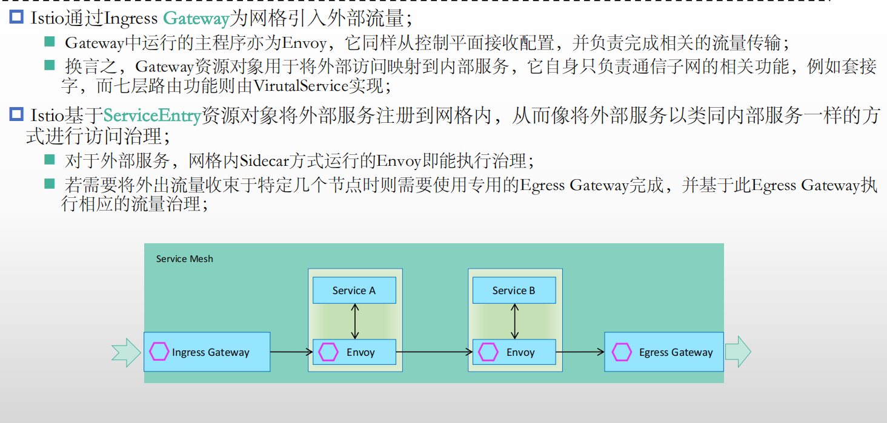

## Istio基础

通过在整个服务环境中为每一个应用部署一个特殊的Sidecar形式的Proxy拦截各服务之间的所有网络通

信，并由控制平面Istio进行配置和管理，进而为服务无侵入式添加如下功能

   ◼ HTTP、gRPC、WebSocket和TCP通信的自动负载均衡；

   ◼ 通过丰富的路由规则、重试、故障转移和故障注入对流量进行细粒度控制；

   ◼ 支持访问控制、速率限制和配额的可插拔的策略层及配置API； 

   ◼ 集群内所有流量的自动度量、记录日志和分布式跟踪跟踪，包括集群的入口和出口；

   ◼ 强大身份验证和授权，以及在群集中进行安全的服务间通信；

### Traffic management

#### 协议代理

#### 动态路由

#### 访问控制

#### 故障注入

### Security

#### mtls通信

#### 最终用户身份认证

#### oauth

### 可观测指标

## Istio架构

借助CRD扩展出来的CR


#### Istio v1.0 Architecture

 控制平面主要有三个组件

   ◼ Pilot：控制平台核心组件

​      ◆管理和配置部署在Istio服务网格中的所有Envoy代理实例

​      ◆为Envoy Sidecar 提供服务发现、智能路由的流量管理功能（例如，A/B 测试、金丝雀推出等）和弹性（超时、重试、断路器等）

   ◼ Citadel：身份和凭据管理等安全相关的功能，实现强大的服务到服务和最终用户身份验证

​       Citadel是Istio控制平面的核心安全组件，负责服务的私钥和数字证书管理，用于提供自动生成、分发、轮换及撤销私钥和数据证书的功能； 

   ◼ Mixer：遥测和策略（访问控制）

​      ◆通过内部插件接口扩展支持第三方组件

​      ◆插件的修改或更新，需要重新部署Mixer

数据平面Envoy

   ◼ 基于sidecar模式同网格中的每个服务实例一同部署

   ◼ 拦截服务流量，强制执行控制平面中定义的策略，并收集遥测数据

#### Istio v1.5 Architecture

 回归单体

   ◼ 抛弃影响性的Mixer，遥测功能交由Envoy自行完成

   ◼ 将Pilot、Citadel、Galley和Sidecar Injector整合为一个单体应用istiod

Istiod

   ◼ Istiod充当控制平面，将配置分发到所有Sidecar代理和网关

   ◼ 它能够为支持网格的应用实现智能化的负载均衡机制，且相关流量绕过了kube-proxy；（读取每一个service来确定整个网格中有几个微服务，将      kubernetes已经实现的各个功能直接自动的转换为网格内部的配置{将service Port识别为一个listener}）

#### 组成

##### Pilot


##### Citadel


##### Galley


##### Ingress Gateway和 Egrss Gateway

进出网格的流量需要一个专门的自定义资源来实现

##### Istio Sidecar Injector

k8s   apiserver对任何一个请求管控的时候（认证，授权，准入控制{检擦资源定义的规范与否，validating mutating}）


##### Kiali

## Istio部署

#### Istio系统组件

控制平面：默认部署于istio-system名称空间

◼ **istiod**

◼ ingress-gateway

◼ egress-gateway

◼ Addons

   ◆Kiali

   ◆Prometheus

   ◆Grafana

   ◆Jaeger

数据平面：默认部署为某名称空间下的各Pod的Sidecar Container

◼ **istio-proxy**


#### Istio控制平面部署

部署方法

   ◼ istioctl

​      ◆Istio的专用管理工具，支持定制控制平面及数据平面

​      ◆通过命令行的选项支持完整的 IstioOperator API{Installistio专用的api}

​      ◆命令行各选项可用于单独设置、以及接收包含IstioOperator自定义资源（CR）的yaml文件

​          Note: 各CR资源对应组件的升级等功能，需要由管理员手动进行

   ◼ Istio Operator

​      ◆Istio相关的自定义资源（CR）的专用控制器，负责自动维护由CR定义的资源对象

​     ◆管理员根据需要定义相应的CR配置文件，提交至Kubernetes API Server后，即可由Operator完成相应的操作

##### 内置的部署档案


定义在istiod Pod的资源限制各种配置档案是有所区别的


istioctl   manifest   generate  --set profile=demo  |  kubectl     apply -f   - 

即将配置转化为K8s的yaml文件

当我们部署好核心组件机器附件的时候，会生成svc,我们应该使用服务网格打开，我们可以定义ingressgateway的相关配置（gateway vs destination的定义）

istio-gateway的svc默认就打开了80端口

```yaml
apiVersion: networking.istio.io/v1beta1
kind: Gateway
metadata:
  name: kiali-gateway
  namespace: istio-system
spec:
  selector:
    app: istio-ingressgateway
  servers:
  - port:
      number: 80
      name: http-kiali
      protocol: HTTP
    hosts:
    - "kiali.wukui.com"   #相当于envoy语境中的virtualhost
---
apiVersion: networking.istio.io/v1beta1
kind: VirtualService
metadata:
    name: kiali-virtualservice
    namespace: istio-system
spec:
  hosts:
  - "kiali.wukui.com"
  gateways:
  - kiali-gateway
  http:
  - match:
      uri:
        prefix: /
    route:
    - destination:
        host: kiali      #集群内有个svc就叫kiali 在istio-system namespcace,目标集群的名称
        port:
          number: 20001

```

## Istio流量治理

GateWay：在我们的网关之上创建listener

该listener为哪些Vritual host接受流量，使用哪一个route至那个destination,需要通过virtualervice进行定义

```yaml
部署好istio控制平面之后，将支持两种自动注入sidecar的方式

root@master01:~# kubectl   label   namespaces  default  istio-injection=enabled

kubectl   run demoapp  --image=ikubernetes/demoapp:v1.0  --restart=Never

root@master01:~# kubectl get pods  -o wide  
NAME                         READY   STATUS    RESTARTS        AGE              IP                  NODE           NOMINATED NODE   READINESS GATES
demoapp                      2/2     Running   0                      7m40s   172.20.186.202   12.0.0.43                        <none>           <none>

root@master01:~# curl -I 172.20.186.202
HTTP/1.1 200 OK
content-type: text/html; charset=utf-8
content-length: 96
server: istio-envoy
date: Tue, 30 Aug 2022 01:34:52 GMT
x-envoy-upstream-service-time: 1
x-envoy-decorator-operation: :0/*

root@master01:~# kubectl   exec -it   demoapp -- curl localhost:15000/listeners   会把发现的集群的所有services全部转为egress listener，这些配置信息都是istiod自动发现svc，然后下发给各个sidecar {istioctl  proxy-status},也就是基于ks8模型的通信，都转化为基于istio网格的通信机制

接下来手动测试，为demoapp pod添加svc,那么就会自动添加到sidecar的listener中

root@master01:~# kubectl   get pods demoapp --show-labels  
NAME      READY   STATUS    RESTARTS   AGE   LABELS
demoapp   2/2     Running   0          66m   run=demoapp,security.istio.io/tlsMode=istio

root@master01:~# kubectl   label  pods demoapp app=demoapp
pod/demoapp labeled
root@master01:~# kubectl  create svc clusterip demoapp --tcp=80:80
service/demoapp created

root@master01:~# kubectl  get  svc  demoapp 
NAME      TYPE        CLUSTER-IP     EXTERNAL-IP   PORT(S)   AGE
demoapp   ClusterIP   10.68.148.26   <none>        80/TCP    15s

root@master01:~# kubectl     exec -it  demoapp -- curl localhost:15000/listeners
...
10.68.148.26_80::10.68.148.26:80

root@master01:~# kubectl     exec -it  demoapp -- curl localhost:15000/clusters  |grep default      |grep    202  
outbound|80||demoapp.default.svc.cluster.local::172.20.186.202:80::cx_active::0
outbound|80||demoapp.default.svc.cluster.local::172.20.186.202:80::cx_connect_fail::0
outbound|80||demoapp.default.svc.cluster.local::172.20.186.202:80::cx_total::0
outbound|80||demoapp.default.svc.cluster.local::172.20.186.202:80::rq_active::0
outbound|80||demoapp.default.svc.cluster.local::172.20.186.202:80::rq_error::0
outbound|80||demoapp.default.svc.cluster.local::172.20.186.202:80::rq_success::0
outbound|80||demoapp.default.svc.cluster.local::172.20.186.202:80::rq_timeout::0
outbound|80||demoapp.default.svc.cluster.local::172.20.186.202:80::rq_total::0
outbound|80||demoapp.default.svc.cluster.local::172.20.186.202:80::hostname::
outbound|80||demoapp.default.svc.cluster.local::172.20.186.202:80::health_flags::healthy
outbound|80||demoapp.default.svc.cluster.local::172.20.186.202:80::weight::1
```


------------

root@master01:~# istioctl  proxy-config     listeners  demoapp           |grep  10.68.148.26   
10.68.148.26   80    Trans: raw_buffer; App: http/1.1,h2c                                     Route: demoapp.default.svc.cluster.local:80
10.68.148.26   80    ALL                                                                                                Cluster: outbound|80||demoapp.default.svc.cluster.local

#### 关键配置




定义之后会在整个集群上相应的listener之上都要加上Virtual host 和路由配置


每一个listener 可以理解为svc的IP 和端口，虚拟服务路由到的位置在istio的语境中叫做**Destination**（集群的定义，算法定义在集群中）

Ingress/Egress Gateway这个front proxy 需要独立配置的

一个ks8的svc会被发现为多个虚拟主机的定义（VH的名字），route会自动添加svc所对应的后端服务（也就是基于EDS配置在集群之上，借助于标签选择器完成的，通常集群的名字以svc的段格式来命名）

创建CR类型的GATEWAY,通过VirtualService定义VH和R,VirtualService定义的目标要指向某个集群（一般是指向svc的名字）

##### 实例

```
root@master01:~# kubectl  get  pods   -n  istio-system 
NAME                                   READY   STATUS    RESTARTS       AGE
kiali-6b455fd9f9-mwk9p                 1/1     Running   1 (4d2h ago)   4d2h
prometheus-7cc96d969f-qdj9f            2/2     Running   2 (4d2h ago)   4d2h
root@master01:~# kubectl  get  svc    -n  istio-system 
NAME                   TYPE           CLUSTER-IP      EXTERNAL-IP   PORT(S)                                                                      AGE                                              4d2h
kiali                  ClusterIP      10.68.39.192    <none>        20001/TCP,9090/TCP            

Cluster Manager与k8s运行在底层Iaas平台API联动(除了在本地创建的service定义成NodePort类型之外还需要调外部的LBaaS由公有云服务生成一个软负载均衡器，这个IP就是EXternal ip )

root@master01:~# kubectl    api-resources  --api-group=networking.istio.io
NAME               SHORTNAMES   APIVERSION                     NAMESPACED   KIND
destinationrules   dr           networking.istio.io/v1beta1    true           DestinationRule
envoyfilters                    networking.istio.io/v1alpha3   true                EnvoyFilter
gateways           gw           networking.istio.io/v1beta1    true              Gateway
proxyconfigs                    networking.istio.io/v1beta1    true               ProxyConfig
serviceentries     se           networking.istio.io/v1beta1    true             ServiceEntry
sidecars                        networking.istio.io/v1beta1    true                   Sidecar
virtualservices    vs           networking.istio.io/v1beta1    true              VirtualService
workloadentries    we           networking.istio.io/v1beta1    true         WorkloadEntry
workloadgroups     wg           networking.istio.io/v1beta1    true        WorkloadGroup
```

 ingw=$(kubectl   get pods  -l app=istio-ingressgateway   -n istio-system  -o jsonpath={.items[0].metadata.name})

```yaml
root@master01:~/istio-1.14.3/samples/addons# cat kiali-Gateway.yaml 
apiVersion: networking.istio.io/v1beta1
kind: Gateway
metadata:
  name: kiali-gateway
  namespace: istio-system
spec:
  selector:
    app: istio-ingressgateway
  servers:
  - port:
      number: 20001
      name: http-kiali
      protocol: HTTP
    hosts:
    - "kiali.wukui.com"

```

root@master01:~/istio-1.14.3/samples/addons# istioctl   proxy-config listeners $ingw  -n istio-system
ADDRESS PORT  MATCH DESTINATION
0.0.0.0 15021 ALL   Inline Route: /healthz/ready*
0.0.0.0 15090 ALL   Inline Route: /stats/prometheus*
0.0.0.0 20001 ALL   Route: http.20001
root@master01:~/istio-1.14.3/samples/addons# istioctl   proxy-config routes $ingw  -n istio-system
NAME               DOMAINS     MATCH                             VIRTUAL SERVICE
http.20001              *                    /*                                      404

​                                 *                      /healthz/ready*        

​                                  *                    /stats/prometheus*     

#对于ingress来讲不会添加任何的路由信息

```yaml
root@master01:~/istio-1.14.3/samples/addons# cat kiali-Virtualservice.yaml
apiVersion: networking.istio.io/v1beta1
kind: VirtualService
metadata:
    name: kiali-virtualservice
    namespace: istio-system
spec:
  hosts:
  - "kiali.wukui.com"
  gateways:
  - kiali-gateway
  http:
  - match:
    - port: 20001
    route:
    - destination:
        host: kiali      #集群内有个svc就叫kiali 在istio-system namespcace,目标集群的名称
        port:
          number: 20001

```

root@master01:~/istio-1.14.3/samples/addons# kubectl   apply -f  kiali-Virtualservice.yaml 
virtualservice.networking.istio.io/kiali-virtualservice created
root@master01:~/istio-1.14.3/samples/addons# kubectl  get vs -n  istio-system  
NAME                   GATEWAYS                        HOSTS                 AGE
kiali-virtualservice   ["kiali-gateway"]   ["kiali.wukui.com"]   21s

再次验证ingress gateway的信息

root@master01:~/istio-1.14.3/samples/addons# istioctl  proxy-config  routes $ingw.istio-system 
NAME           DOMAINS                                            MATCH                                                                 VIRTUAL SERVICE
http.20001     kiali.wukui.com                                     /*                                                           kiali-virtualservice.istio-system

​                                                                                         /healthz/ready*        

​                                                                                          /stats/prometheus*     

root@master01:~/istio-1.14.3/samples/addons# kubectl   edit svc  istio-ingressgateway  -n istio-system
service/istio-ingressgateway edited

root@master01:~/istio-1.14.3/samples/addons# istioctl   proxy-config   clusters $ingw.istio-system     |grep kiali  
kiali.istio-system.svc.cluster.local                              9090      -          outbound      EDS            
kiali.istio-system.svc.cluster.local                              20001     -          outbound      EDS            

```yaml
...
externalIPs:
- 12.0.0.41
- 12.0.0.42
...
- name: http-kiali
  nodePort: 42072
  port: 20001
  protocol: TCP
  targetPort: 20001

```

```yaml
root@master01:~/istio-1.14.3/samples/addons# cat kiali-destinationrule.yaml
apiVersion: networking.istio.io/v1beta1
kind: DestinationRule
metadata:
  name: kiali-destinationrule
  namespace: istio-system
spec:
  host: kiali   #svc名称
  trafficPolicy:
    tls:
      mode: DISABLE

```


-------------


```yaml
root@master01:~/istio-1.14.3/samples/demo# cat deploy-demoapp-v10.yaml
apiVersion: apps/v1
kind: Deployment
metadata:
  creationTimestamp: null
  labels:
    app: demoapp
  name: demoappv10
spec:
  replicas: 3
  selector:
    matchLabels:
      app: demoapp
      version: v1.0
  strategy: {}
  template:
    metadata:
      creationTimestamp: null
      labels:
        app: demoapp
        version: v1.0
    spec:
      containers:
      - image: ikubernetes/demoapp:v1.0
        name: demoapp
        env:
        - name: PORT
          value: "8080"
        resources: {}
---
apiVersion: v1
kind: Service
metadata:
  name: demoappv10
  labels:
    app: demoapp
spec:
  ports:
  - name: http-8080
    port: 8080
    protocol: TCP
    targetPort: 8080
  selector:
    app: demoapp
    version: v1.0
  type: ClusterIP

root@master01:~/istio-1.14.3/samples/demo# kubectl  get  pods  
NAME                          READY   STATUS    RESTARTS   AGE
demoappv10-75db87664c-fbt65   2/2     Running   0          29s
demoappv10-75db87664c-h68s8   2/2     Running   0          29s
demoappv10-75db87664c-qd7g4   2/2     Running   0          29s
root@master01:~/istio-1.14.3/samples/demo# DEMOAPP=$(kubectl   get pods -l  app=demoapp  -o jsonpath={.items[0].metadata.name})
root@master01:~/istio-1.14.3/samples/demo# istioctl   proxy-config listeners $DEMOAPP   --port 8080
ADDRESS PORT MATCH                                DESTINATION
0.0.0.0 8080 Trans: raw_buffer; App: http/1.1,h2c Route: 8080
0.0.0.0 8080 ALL                                  PassthroughCluster
root@master01:~/istio-1.14.3/samples/demo# istioctl   proxy-config clusters  $DEMOAPP   
root@master01:~/istio-1.14.3/samples/demo# istioctl   proxy-config  endpoints  $DEMOAPP
我们现在启动一个测试的Pod,这个测试的Pod会被自动注入一个sidecar，并且箭头监听demoappv10的svc相关的端口，这个pod的出站流量是被这个listener所捕获的 ，我们可以进入进入到pod中通过curl localhost:15000/listeners查看

```

接下来我们为demoappv10添加一个前端程序proxy,我们可以对proxy进行访问

```yaml
apiVersion: apps/v1
kind: Deployment
metadata:
  name: proxy
spec:
  replicas: 1
  selector:
    matchLabels:
      app: proxy
  template:
    metadata: 
      labels:
        app: proxy
    spec:
      containers:
      - image: ikubernetes/proxy:v0.1.1
        name: proxy
        imagePullPolicy: IfNotPresent
        env:
        - name: PROXYURL
          value: http://demoappv10:8080
        ports:
        - containerPort: 8080
          name: web
          protocol: TCP
        resources:
          limits:
            cpu: 60m
---
apiVersion: v1
kind: Service
metadata:
  name: proxy
spec:
  ports:
  - name: http-80       #固定格式，协议加端口
    port: 80
    protocol: TCP
    targetPort: 8080
  selector:
    app: proxy
  type: ClusterIP
```


当我们访问某一个服务的时候http://demoapp（也就是说必须有一个demoapp 的SVC来提供服务）有可能调度不同的版本的服务，还可以进行高级的定义


```yaml
apiVersion: apps/v1
kind: Deployment
metadata:
  name: proxy
spec:
  replicas: 1
  selector:
    matchLabels:
      app: proxy
  template:
    metadata: 
      labels:
        app: proxy
    spec:
      containers:
      - image: ikubernetes/proxy:v0.1.1
        name: proxy
        imagePullPolicy: IfNotPresent
        env:
        - name: PROXYURL
          value: http://demoapp:8080
        ports:
        - containerPort: 8080
          name: web
          protocol: TCP
        resources:
          limits:
            cpu: 60m
---
apiVersion: v1
kind: Service
metadata:
  name: proxy
spec:
  ports:
  - name: http-80       #固定格式，协议加端口
    port: 80
    protocol: TCP
    targetPort: 8080
  selector:
    app: proxy
  type: ClusterIP
root@master01:~/istio-1.14.3/samples/demo# cat deploy-demoapp-v11.yaml
apiVersion: apps/v1
kind: Deployment
metadata:
  labels:
    app: demoapp
  name: demoappv11
spec:
  replicas: 3
  selector:
    matchLabels:
      app: demoapp
      version: v1.1
  strategy: {}
  template:
    metadata:
      creationTimestamp: null
      labels:
        app: demoapp
        version: v1.1
    spec:
      containers:
      - image: ikubernetes/demoapp:v1.1
        name: demoapp
        env:
        - name: PORT
          value: "8080"
        resources: {}
---
apiVersion: v1
kind: Service
metadata:
  name: demoappv11
  labels:
    app: demoapp
spec:
  ports:
  - name: http-8080
    port: 8080
    protocol: TCP
    targetPort: 8080
  selector:
    app: demoapp
    version: v1.1
  type: ClusterIP
```

demoapp本身提供的是一个服务，只是提供了多个不同的版本，可以把他们划分为不同的子集，envoy中是在集群中定义的，router中定义

我们通过定义destinationrule.spec.subsets.labels来选择后端的pod作为谁的子集，这样就避免了为deploy控制器创建svc


**.png)**

-----------------------------

假设我们的frontend希望被外部访问，我们需要定义gateway和gateway上的vs

```yaml
apiVersion: networking.istio.io/v1beta1
kind: Gateway
metadata:
  name: proxy-gateway
  namespace: istio-system
spec:
  selector:
    app: istio-ingressgateway
  servers:
  - port:
      number: 80         #这个端口默认就启用了
      name: http-fronted
      protocol: HTTP
    hosts:
    - "frontend.wukui.com"
---
apiVersion: networking.istio.io/v1beta1
kind: VirtualService
metadata:
    name: frontend-virtualservice
    namespace: istio-system
spec:
  hosts:
  - "frontend.wukui.com"
  gateways:
  - proxy-gateway
  #- mesh
  http:
  - name: default
    route:
    - destination:
        host: proxy   #因为我们有一个同名的svc，因为在创建svc之后，会自动注入相关的proxy-config 配置，会生成集群（clusters $ingw.istio.system）
```

#### 流量治理进阶


exportTo 开放到哪些namespace使用

##### HTTPRoute配置实例


##### url-redirect-and-rewrite

```yaml

apiVersion: networking.istio.io/v1beta1
kind: VirtualService
metadata:
    name: demoapp
spec:
  hosts:
  - demoapp
  http:
  - name: rewrite
    match:
    - uri:
        prefix: /canary
    rewrite:                 #是在服务端进行的，客户端透明
      uri: /
    route:
    - destinations:
        host: demoapp
        subset: v11
  - name: redirect
    match:
    - uri:
        prefix: "/backend"
    redirect:                 #返回错误响应码，重新发送请求
      uri: /
      authority: backend
      port: 8082
  - name: default   
    route:
    - destinations:
        host: demoapp
        subset: v10
```


```yaml
apiVersion: networking.istio.io/v1beta1
kind: VirtualService
metadata:
    name: demoapp
spec:
  hosts:
  - demoapp
  http:
  - name: canary
    match:
    - headers:
        x-canary:
          exact: "true"
    route:
    - destinations:
        host: demoapp
        subset: v11
       headers:
         request:
           set:
             User-Agent: Chrome
         response:
           add:
             x-canary: "true"
  - name: default
    headers:
      response:
        add:
          x-Envoy: test
    route:
    - destinations:
        host: demoapp
        subset: v10
        
```

##### 故障注入

```yaml
apiVersion: networking.istio.io/v1beta1
kind: VirtualService
metadata:
    name: demoapp
spec:
  hosts:
  - demoapp
  http:
  - name: rewrite
    match:
    - uri:
        prefix: /canary
    rewrite:                 #是在服务端进行的，客户端透明
      uri: /
    route:
    - destinations:
        host: demoapp
        subset: v11
    fault:
      abort:
        percentage:
          value: 20
        httpStaus: 555
  - name: default   
    route:
    - destinations:
        host: demoapp
        subset: v10
    fault:
      delay:
        percentage:
          value: 20
        fixedDelay: 3s         #注入3秒的延迟故障
```

##### HTTP Retry和Timeout


##### DestinationRule高级应用


```yaml
apiVersion: networking.istio.io/v1beta1
kind: DestinationRule
metadata:
  name: demoapp
spec:
  host: demoapp
  trafficPolicy:
    loadBalancer:
      simple: LEAST_CONN       #全局负载均衡策略为最少连接
  subsets:
  - name: v10
    labels:
      version: v1.0
    trafficPolicy:
       loadBalancer:
         consistentHash:
           httpHeaderName: x-User        #如果标头满足则调度给v10,不一样选择全局策略
   - name: v11
     labels:
       version: v1.1
```

###### Connection Pool 

一但请求超出了连接池，上游的返回全是错误的，可以启动断路器（相当于envoy的异常值探测）


###### Outlier Detection

## Sidecar及其流量拦截机制

 出向

   ◼ 15001/TCP

​      ◆ 转发给请求原请求的目标地址和端口，相应的engree listener

​      ◆ 不存在的engress listener,根据traffic policy

​         ◆ ALLOW_ALL 将流量透传给目标端

​         ◆ REGISTRY_ONLY: 将流量传给BlackHoleCluster

 入向

   ◼ 15006/TCP

​      ◆ 创建一组Filter Chains,每个Filter Chain都会定义一个至多个FilterChainMatch,从而匹配特定的流量

​          ◆ 每个FilterChain都有一组Filter,由其处理

​                http_connection_manager

​                    VirtualHost---Route---Destination---Cluster


.png)

#### Sidecar代理方式简介

 Kubernetes平台上，Envoy Sidecar容器与application容器于同一个Pod中共存，它们共享NETWORK、UTS和IPC等名称空间，因此也共用同一个网络协议栈；

   ◼ Envoy Sidecar基于init容器（需要使用NET_ADMIN和NET_RAW Capability于Pod启动时设置iptables规则以实现流量拦截）

​      ◆ 入站流量由iptables拦截后转发给Envoy

​      ◆ Envoy根据配置完成入站流量代理

​      ◆ 后端应用程序生成的出站流量依然由iptables拦截并转发给Envoy

​      ◆ Envoy根据配置完成出站流量代理

 流量拦截模式

   ◼ REDIRECT：重定向模式       #IPtables中有端口重定向的选项，可以把app的端口重定向给sidecar的端口

   ◼ TPROXY：透明代理模式      

​       ◆ 具体操作细节请参考：https://github.com/istio/istio/blob/master/tools/packaging/common/istio-start.sh

##### Sidecar Envoy 流量劫持

一但到达pod的网络名称空间之后，就会由iptables把流量转给sidecar,再到app

先由app到达内核，经过转发到达sidecar

流量的透明劫持

◼ 流量的透明劫持，用于确保让应用无需事先改造即可获得服务治理和观测能力

◼ 开启透明劫持功能后，出入应用的业务流量将会被Sidecar Envoy自动拦截

###### 劫持过程


#### Istio注入的Envoy Sidecar


##### istio-init初始化容器


###### Istio中用于流量拦截的iptables规则

nsenter命令于宿主机上可直接于目标容器的网络名称空间中运行iptables命令，例如，假设productpage 相关的Pod被调度运行于k8s-node02节点之上，且其内部的envoy进程的pid在宿主机为5670

ps -aux    |grep envoy  

```
root@k8s-node02:~#nsenter-t 5670-n iptables -t nat-S  
-P PREROUTING ACCEPT  #nat表上的四个链都定义为accept
-P INPUTACCEPT
-P OUTPUTACCEPT
-P POSTROUTINGACCEPT
-N ISTIO_INBOUND
-N ISTIO_IN_REDIRECT   #添加新的自定义链
-N ISTIO_OUTPUT
-N ISTIO_REDIRECT
-A PREROUTING-p tcp -j ISTIO_INBOUND
-A OUTPUT -ptcp -j ISTIO_OUTPUT
-A ISTIO_INBOUND-p tcp -m tcp --dport 15008-j RETURN   #RETURN直接回到主链，不做劫持
-A ISTIO_INBOUND-p tcp -m tcp --dport 22 -j RETURN
-A ISTIO_INBOUND-p tcp -m tcp --dport 15090-j RETURN
-A ISTIO_INBOUND-p tcp -m tcp --dport 15021-j RETURN
-A ISTIO_INBOUND-p tcp -m tcp --dport 15020-j RETURN
-A ISTIO_INBOUND-p tcp -j ISTIO_IN_REDIRECT
-A ISTIO_IN_REDIRECT-p tcp -j REDIRECT--to-ports 15006
-A ISTIO_OUTPUT-s 127.0.0.6/32-o lo -j RETURN
-A ISTIO_OUTPUT! -d 127.0.0.1/32-o lo -m owner --uid-owner1337 -j ISTIO_IN_REDIRECT -A ISTIO_OUTPUT-o lo -m owner ! --uid-owner 1337-j RETURN    #envoy自己访问app应用程序
-A ISTIO_OUTPUT-m owner --uid-owner1337 -j RETURN
-A ISTIO_OUTPUT! -d 127.0.0.1/32-o lo -m owner --gid-owner1337 -j ISTIO_IN_REDIRECT -A ISTIO_OUTPUT-o lo -m owner ! --gid-owner1337-j RETURN
-A ISTIO_OUTPUT-m owner --gid-owner1337 -j RETURN
-A ISTIO_OUTPUT-d 127.0.0.1/32-j RETURN
-A ISTIO_OUTPUT-j ISTIO_REDIRECT
-A ISTIO_REDIRECT-p tcp -j REDIRECT--to-ports 15001
```

Istio流量拦截的处理机制：


Ports used by Istio：


##### Istio-proxy容器

 istio-proxy即所谓的sidecar容器，它运行两个进程

   ◼ pilot-agent

​      ◆ 基于k8s api server为envoy初始化出可用的boostrap配置文件并启动envoy； 

​      ◆ 监控并管理envoy的运行状态，包括envoy出错时重启envoy，以及envoy配置变更后将其重载等；

   ◼ envoy

​      ◆ envoy由pilot-agent进程基于生成bootstrap配置进行启动，而后根据配置中指定的pilot地址，通过xDS API获取动态配置信息；

​      ◆ Sidecar形式的Envoy通过流量拦截机制为应用程序实现入站和出站代理功能；

```
~# kubectl exec productpage-v1-596598f447-g8rkz -c istio-proxy -- ps aux
USER PID %CPU %MEM VSZ RSS TTY STAT START TIME COMMAND
istio-p+ 1 0.0 0.6 749316 51648 ? Ssl Dec22 0:18 /usr/local/bin/pilot-agent proxy sidecar --domain default.svc.cluster.local --proxyLogLevel=warning --
proxyComponentLogLevel=misc:error --log_output_level=default:info --concurrency 2
istio-p+ 16 0.0 0.7 186452 59676 ? Sl Dec22 0:59 /usr/local/bin/envoy -c etc/istio/proxy/envoy-rev0.json --restart-epoch 0 --drain-time-s 45 --drain-strategy 
immediate --parent-shutdown-time-s 60 --local-address-ip-version v4 --file-flush-interval-msec 1000 --disable-hot-restart --log-format %Y-%m-%dT%T.%fZ.%l.envoy %n.%v -l 
warning --component-log-level misc:error --concurrency 2
```

###### Istio-proxy容器及其Listener

 Envoy的bootstrap配置文件由pilot-agent负责生成，而生效的大多配置则定义成了dynamic resources，并通过xDS静态集群指向的Pilot获取；

   ◼ 而这些配置则来自于VirtualService、DestinationRule、Gateway和ServiceEntry资源对象等提供的配置；

由Pilot基于Kubernetes发现的网格内的各Service均会被自动转换为下发给各Sidecar实例的Listener、Route、Cluster和Endpoint的相关配置

   ◼ 为了能够让Sidecar Envoy代理网格内进出各Service的流量，所以需要进行流量劫持，而后由Envoy根据请求特征，将流量派发至合适的Listener，进而完成后  续的流量路由、负载均衡等

kubectl exec -it $PODNAME -c istio-proxy -- pilot-agent  request GET /listeners

###### VirtualOutbound Listener

istio-proxy尽管使用了15001和15006这样的端口，但是他们只是一个虚拟的端口


###### VirtualInbound Listener

kubectl exec -it $PODNAME -c istio-proxy -- pilot-agent  request GET /config_dump 


.png)

###### Istio-proxy上的动态集群


#### Sidecar  CR


##### sidecar配置实例


```yaml
apiVersion: networking.istio.io/v1beat1
kind: Sidecar
metadata:
  name: client
  namespace: default
spec:
  workloadSelector:
    labels:
      run: client
  outboundTrafficPolicy:
    mode: REGISTRY_ONLY
  egress:
    port:
      number: 8008
      protocol: HTTP
      name: demoapp
    host:
      "./*"   #可以使用任何域名称
#此时出站侦听器只添加了一个（8080端口），我们在客户端内部就可以访问dempapp:8080 但是当我们访问proxy的时候是拒绝的（需要将模式改为ALLOW_ANY,只是透传了一下，而且当我们访问proxy的时候，proxy自己会把流量转给demoapp,也就隐藏了client的地址）
```

## 访问网格外部的服务

**Conclusion:**主要是通过ServiceEntry将集群外部的服务纳入到网格之内

没有生成egress listener的时候（采用ALLOW_ANY）只是起到了一个passthrough的功能，相当于一个匿名的客户端直接访问了外部服务，sidecar也无法使用其

高级流量治理功能，需要将外部的服务引入到服务注册表


#### Service Entry 


##### 资源规范


###### 配置实例


```yaml
apiVersion: networking.istio.io/v1beta1
kind: ServiceEntry
metadata:
  name: nginx-external
spec:
  hosts:
  - nginx.magedu.com
  addresses:                 #访问的主机头部
  - "172.29.1.201"
  - "172.29.1.202"
  - "172.29.1.203"
  ports:                     #
  - number: 8091
    name: http
    protocol: HTTP
  location: MESH_EXTERNAL
  resolution: STATIC
  endpoints:
  - address: "172.29.1.201"
    ports:
      http: 8091
  - address: "172.29.1.202"
    ports:
      http: 8091
  - address: "172.29.1.203"
    ports:
      http: 8091
---
apiVersion: networking.istio.io/v1beta1
kind: DestinationRule
metadata:
  name: nginx-external
spec:
  host: nginx.magedu.com
  trafficPolicy:
    loadBalancer:
      consistentHash:
        httpHeaderName: X-User                       #Hash based on a specific HTTP header
    connectionPool:
      tcp:
        maxConnections: 10000
        connectTimeout: 10ms
        tcpKeepalive:
          time: 7200s
          interval: 75s
      http:
        http2MaxRequests: 1000
        maxRequestsPerConnection: 10
    outlierDetection:
      maxEjectionPercent: 50
      consecutive5xxErrors: 5
      interval: 2m
      baseEjectionTime: 1m
      minHealthPercent: 40
---
apiVersion: networking.istio.io/v1beta1
kind: VirtualService                #流量的管理比例的定义
metadata:
  name: nginx-external
spec:
  hosts:
  - nginx.magedu.com
  http:
  - name: falut-injection
    match:
    - headers:                        
        X-Testing:                             
          exact: "true"
    route:
    - destination:
        host: nginx.magedu.com
    fault:                            #注入故障的流量比例
      delay:
        percentage:
          value: 5
        fixedDelay: 2s
      abort:
        percentage:
          value: 5
        httpStatus: 555
  - name: nginx-external             #剩余的正常流量
    route:
    - destination:
        host: nginx.magedu.com

```

#### WorkloadEntry 和 WorkloadGroup


##### 资源规范


###### 配置实例

```yaml
apiVersion: networking.istio.io/v1beta1
kind: WorkloadEntry
metadata:
  name: workload-nginx2001
spec:
  address: "172.29.1.201"
  ports:
    http: 8091
  labels:
    app: nginx
    version: "v1.20"
    instance-id: Nginx2001
---
apiVersion: networking.istio.io/v1beta1
kind: WorkloadEntry
metadata:
  name: workload-nginx2002
spec:
  address: "172.29.1.202"
  ports:
    http: 8091
  labels:
    app: nginx
    version: "v1.20"
    instance-id: Nginx2002
---
apiVersion: networking.istio.io/v1beta1
kind: WorkloadEntry
metadata:
  name: workload-nginx2101
spec:
  address: "172.29.1.203"
  ports:
    http: 8091
  labels:
    app: nginx
    version: "v1.21"
    instance-id: Nginx2101
---
apiVersion: networking.istio.io/v1beta1
kind: ServiceEntry
metadata:
  name: nginx-external
spec:
  hosts:
  - nginx.magedu.com
  ports:
  - number: 80                             #svc端口换成标准端口
    name: http
    protocol: HTTP
    #targetPort: 8091
  location: MESH_EXTERNAL
  resolution: STATIC
  workloadSelector:
    labels:
      app: nginx
---
apiVersion: networking.istio.io/v1beta1
kind: DestinationRule
metadata:
  name: nginx-external
spec:
  host: nginx.magedu.com
  trafficPolicy:
    loadBalancer:
      simple: RANDOM
    connectionPool:
      tcp:
        maxConnections: 10000
        connectTimeout: 10ms
        tcpKeepalive:
          time: 7200s
          interval: 75s
      http:
        http2MaxRequests: 1000
        maxRequestsPerConnection: 10
    outlierDetection:
      maxEjectionPercent: 50
      consecutive5xxErrors: 5
      interval: 2m
      baseEjectionTime: 1m
      minHealthPercent: 40
  subsets:
  - name: v20
    labels:
      version: "v1.20"
  - name: v21
    labels:
      version: "v1.21"
---
apiVersion: networking.istio.io/v1beta1
kind: VirtualService
metadata:
  name: nginx-external
spec:
  hosts:
  - nginx.magedu.com
  http:
  - name: default
    route:
    - destination:
        host: nginx.magedu.com
        subset: v21
      weight: 5
    - destination:
        host: nginx.magedu.com
        subset: v20
      weight: 95

```

```yaml
apiVersion: networking.istio.io/v1beta1
kind: VirtualService
metadata:
  name: nginx-external
spec:
  hosts:
  - nginx.magedu.com
  http:
  - name: falut-injection
    match:
    - headers:
        X-Canary:
          exact: "true"
    route:
    - destination:
        host: nginx.magedu.com
        subset: v21
    fault:
      delay:
        percentage:
          value: 5
        fixedDelay: 2s
  - name: default
    route:
    - destination:
        host: nginx.magedu.com
        subset: v20
    fault:
      abort:
        percentage:
          value: 5
        httpStatus: 555

```

#### Egress Gateway

借助engress gateway将发往集群外部的出向流量（pod的流量通过sidecar entry{service entry},到达engress gateway,再到workload）

应用在网格内部（mesh）的每一个sidecar envoy,将流量路由给engress gateway,再由engress gateway，发送到workload

```yaml
apiVersion: networking.istio.io/v1beta1
kind: WorkloadEntry
metadata:
  name: workload-nginx2001
spec:
  address: "172.29.1.201"
  ports:
    http: 8091
  labels:
    app: nginx
    version: "v1.20"
    instance-id: Nginx2001
---
apiVersion: networking.istio.io/v1beta1
kind: WorkloadEntry
metadata:
  name: workload-nginx2002
spec:
  address: "172.29.1.202"
  ports:
    http: 8091
  labels:
    app: nginx
    version: "v1.20"
    instance-id: Nginx2002
---
apiVersion: networking.istio.io/v1beta1
kind: WorkloadEntry
metadata:
  name: workload-nginx2101
spec:
  address: "172.29.1.203"
  ports:
    http: 8091
  labels:
    app: nginx
    version: "v1.21"
    instance-id: Nginx2101
---
apiVersion: networking.istio.io/v1beta1
kind: ServiceEntry
metadata:
  name: nginx-external
spec:
  hosts:
  - nginx.magedu.com
  ports:
  - number: 80                             #svc端口换成标准端口
    name: http
    protocol: HTTP
    #targetPort: 8091
  location: MESH_EXTERNAL
  resolution: STATIC
  workloadSelector:
    labels:
      app: nginx
---
apiVersion: networking.istio.io/v1beta1
kind: DestinationRule
metadata:
  name: nginx-external
spec:
  host: nginx.magedu.com
  trafficPolicy:
    loadBalancer:
      simple: RANDOM
    connectionPool:
      tcp:
        maxConnections: 10000
        connectTimeout: 10ms
        tcpKeepalive:
          time: 7200s
          interval: 75s
      http:
        http2MaxRequests: 1000
        maxRequestsPerConnection: 10
    outlierDetection:
      maxEjectionPercent: 50
      consecutive5xxErrors: 5
      interval: 2m
      baseEjectionTime: 1m
      minHealthPercent: 40
  subsets:
  - name: v20
    labels:
      version: "v1.20"
  - name: v21
    labels:
      version: "v1.21"
---
apiVersion: networking.istio.io/v1beta1
kind: Gateway
metadata:
  name: egress
  namespace: istio-system
spec:
  selector:
    app: istio-egressgateway
  servers:
  - port:
      number: 80
      name: http
      protocol: HTTP
    hosts:
    - "*"
---
apiVersion: networking.istio.io/v1beta1
kind: VirtualService
metadata:
  name: nginx-external
spec:
  hosts:
  - nginx.magedu.com
  gateways:
  - istio-system/egress
  - mesh
  http:
  - match:
    - gateways:
      - mesh
    route:
    - destination:
        host: istio-egressgateway.istio-system.svc.cluster.local
  - match:
    - gateways:
      - istio-system/egress
    route:
    - destination:
        host: nginx.magedu.com
        subset: v21
      weight: 5
    - destination:
        host: nginx.magedu.com
        subset: v20
      weight: 95

```

## Envoy  Filter

在之前的陈述中，可以通过Sidecar CR来决为将哪些服务自动添加到哪些Pod中

将配置envoy filter的API直接以打补丁的方式向envoy提供配置

**Istio的功能及其相关实现组件:**

Istio提供了如下开箱即用（Out Of The Box）的功能

   ◼ Service Discovery / Load Balancing    → ServicEntry + DestinationRule

   ◼ Secure service-to-service communication (mTLS)   → DestinationRule

   ◼ Traffic control / shaping / shifting    → VirtualService

   ◼ Policy / Intention based access control    → AuthorizationPolicy

   ◼ Traffic metric collection    → (built in)

配置实例


```yaml
apiVersion: networking.istio.io/v1alpha3
kind: EnvoyFilter
metadata:
  name: custom-protocol
  namespace: istio-config # as defined in meshConfig resource.
spec:
  configPatches:
  - applyTo: NETWORK_FILTER
    match:
      context: SIDECAR_OUTBOUND # will match outbound listeners in all sidecars
      listener:
        portNumber: 9307
        filterChain:
          filter:
            name: "envoy.filters.network.tcp_proxy"
    patch:
      operation: INSERT_BEFORE
      value:
        # This is the full filter config including the name and typed_config section.
        name: "envoy.extensions.filters.network.mongo_proxy"
        typed_config:
          "@type": "type.googleapis.com/envoy.extensions.filters.network.mongo_proxy.v3.MongoProxy"
          ...
  - applyTo: NETWORK_FILTER # http connection manager is a filter in Envoy
    match:
      # context omitted so that this applies to both sidecars and gateways
      listener:
        filterChain:
          filter:
            name: "envoy.filters.network.http_connection_manager"
    patch:
      operation: MERGE
      value:
        name: "envoy.filters.network.http_connection_manager"
        typed_config:
          "@type": "type.googleapis.com/envoy.extensions.filters.network.http_connection_manager.v3.HttpConnectionManager"
          common_http_protocol_options:
            idle_timeout: 30s

```

## Telemetry v2


通过额外开发一个WASM插件的方式来实现服务指标

#### lstio的可观测性

istio的Metrice对外部的promethous有特殊要求，需要进行特殊的配置

但是**Distributed Traces**和**access log**没有限制，可以告诉istio（provider）我们的分布式跟踪系统或者访问日志的入口是什么（可以是外部的系统），但是promethous不这样实现，他有一种联邦机制，在istio内部有部署的promethous,专用于收集服务网格的指标{}，网格外部部署一个高可用的promethous，可以将他们对接到网格内的监控系统


这些指标的上报都是由istio-proxy来完成的，它到底要上报哪些指标，可以通过部署istio来进行配置也可以通过MeshConfig 或者Telemetry CR进行定义

#### 启用网格的可观测性


#### Telemetry CR

要想能够存储数据我们的有一个**provider**,provider可能会保存有很多的时序数据，这些数据数据究竟是由客户端存上的还是服务端存储的。

服务级指标都有一个标签**reporter**

istio在envoy之上额外提供了一个插件stats，其实现的功能就是网格中的服务指标的功能，该插件可以以WASM的方式来运行{动态装卸载，也可以静态编译在envoy中}

Telemetry.spec.metrics.overrides.MetricsOverrides 用来自定义指标名称和重新打标签


#### Istio的可观测性——Metrics


##### 代理级指标


.png)

.png)

curl  PODIP:15020/stats

Pod内部会监听一个15000的端口{就是envoy的admin interface}

###### 网格上配置代理指标(默认最小子集)

istioctl manifest generate --set profile=demo  这是k8s级别的配置

istioctl profile dump default 

istioctl install -f istio-meshconfig-update.yaml

```yaml
#cat istio-meshconfig-update.yaml
apiVersion: install.istio.io/v1alpha1
kind: IstioOperator
spec:
  meshConfig:
    accessLogFile: /dev/stdout
    defaultConfig:
      proxyMetadata: {}
      proxyStatsMatcher:
        inclusionRegexps:
          - ".*circuit_breakers.*"
        inclusionPrefixes:
          - "upstream_rq_retry"
          - "upstream_cx"
    enablePrometheusMerge: true
  profile: demo
```


我们应该通过**Telemetry CR**来实现

##### 服务级指标

Istio暴露的服务级指标用于监控服务间通信

   ◼ 这类指标涵盖了服务监控的四个基本需求：延迟、流量、错误和饱和度

   ◼ Istio默认配置了一组服务指标（通常也可称为标准指标），并将这些指标导出至Prometheus监控系统

   ◼ 舍弃Mixer之后，Istio的这些服务指标则由Envoy代理通过Proxy-wasm插件直接导出

###### 服务级指标的实现


###### 网格中启动stats扩展中定义的指标


###### Istio的服务级指标

针对HTTP、HTTP/2和GRPC流量的指标

   ◼ Request Count (istio_requests_total)：处理的总请求数，COUNTER类型；

   ◼ Request Duration (istio_request_duration_milliseconds)：请求的持续时长，HISTOGRAM类型；

   ◼ Request Size (istio_request_bytes)：请求体大小，HISTOGRAM类型；

   ◼ Response Size (istio_response_bytes)：响应体大小，HISTOGRAM类型；

   ◼ gRPC Request Message Count (istio_request_messages_total)：gRPC连接，请求消息总数；

   ◼ gRPC Response Message Count (istio_response_messages_total)：gRPC连接，响应消息总数；

针对TCP流量的指标

   ◼ Tcp Bytes Sent (istio_tcp_sent_bytes_total)：在TCP连接中总共发送的字节数，COUNTER类型；

   ◼ Tcp Bytes Received (istio_tcp_received_bytes_total)：在TCP连接中总共接收的字节数，COUNTER类型；

   ◼ Tcp Connections Opened (istio_tcp_connections_opened_total)：总共打开的TCP连接数量，COUNTER类型；

   ◼ Tcp Connections Closed (istio_tcp_connections_closed_total)：总共关闭的TCP连接数量， COUNTER类型；

###### 获取Envoy上的服务级指标

 验证服务级指标，以示例中的client Pod为例

   ◼ 获取该Pod上的prometheus指标（由Envoy直接导出的prometheus格式的指标）

​      ◆kubectl exec client -n default -- curl -sS localhost:15000/stats/prometheus | grep -o “^istio_[a-zA-Z_]*” | sort -u 或者

​      ◆kubectl exec client -c istio-proxy -- pilot-agent request GET /stats/prometheus | grep -o "^istio_[a-zA-Z_]*" | sort -u

这些指标可以通过Telemetry CR进行修改

###### 服务级指标相关的时间序列


###### 服务级指标上默认使用的标签


###### 配置服务级别的指标


Telemetry的在**根名称空间**使用的时，全网格生效

名称空间级配置

```yaml
apiVersion: telemetry.istio.io/v1alpha1
kind: Telemetry
metadata:
  name: namespace-metrics
  namespace: default
spec:
  # no selector specified, applies to all workloads in the namespace
  metrics:
  - providers:
    - name: prometheus
    overrides:
    # match clause left off matches all istio metrics, client and server
    - tagOverrides:
        request_method:
          value: "request.method"
        request_host:
          value: "request.host"
---
apiVersion: apps/v1
kind: Deployment
metadata:
  labels:
    app: demoappv10
    version: v1.0
  name: demoappv10
spec:
  progressDeadlineSeconds: 600
  replicas: 3
  selector:
    matchLabels:
      app: demoapp
      version: v1.0
  template:
    metadata:
      labels:
        app: demoapp
        version: v1.0
      annotations:
        sidecar.istio.io/extraStatTags: request_method, request_host
    spec:
      containers:
      - image: ikubernetes/demoapp:v1.0
        imagePullPolicy: IfNotPresent
        name: demoapp
        env:
        - name: "PORT"
          value: "8080"
        ports:
        - containerPort: 8080
          name: web
          protocol: TCP
        resources:
          limits:
            cpu: 50m
```

##### 控制平面指标


curl  istiodPodIP:15014 /metrics

## Istio网格访问日志

只需要在网格之外部署好一个elk，各个节点部署好fluentd,能采集任何容器的日志，送到存储数数据库中


#### 启用网格日志


## Istio网格中的分布式跟踪


.png)

## Istio Security

服务和服务之间的流量在传输过程中是不是安全的

service允许来自于特定身份的客户端访问，还有就是我们如何识别这个访问者就是我们允许的客户端

如何为每一个实例提供一个 身份，这个身份还必须要合理的被服务端所认可


当我们需要注册某一个工作负载的时候，节点之上的agent需要证明身份到spire server,然后spire server通过中间组件校验节点的身份，节点可信之后server会给agent发一个node SVID 随后workload 向暴露了workload  api agent 发送证明自己身份的请求（也是通过中间组件证明） ，然后agent根据获得的worlload的信息向server发起身份验证请求，签署workload SVID ,agent缓存下来用来workload请求时使用

#### Service Mesh Authentication

 IAAA Framework for Microservice APIs

​    ◼ Identification: Must support multiple identities and attributes (end users, system components, domains)Identification

​    ◼ Authentication (auth/n): Must support multiple authentication methods as well as delegated authentication 

​    ◼ Authorization (auth/z): Authorizationfor a single request may be decided at multiple points in the request path

​    ◼ Accountability: Capture of relevant security data or metadata from API messages


#### 身份标识和证书管理

两个代理服务之间建立Peer authentication和Request authentication，只需要在控制平面上定义好认证策略。istiod自动分发给各个envoy实例

Istio使用**X.509证书为每个工作负载提供身份标识**

每个istio-proxy容器中与envoy相伴运行的pilot-agent负责同istiod协同完成私钥和证书的轮换

   istio-proxy容器中的pilot-agent进程为envoy进程生成Bootstrap文件，还要与pilot交互生成各种证书，基于SDS给envoy

Istio提供私钥和证书的流程如下

   ① istiod提供gRPC服务来接受证书签名请求（CSRs）；

   ② 启动时，Istio Proxy容器中的pilot-agent会创建私钥和CSR，并将CSR及其凭据发送给istiod完成签名；

   ③ istiod上的CA负责验证CSR中携带的凭据，并在成功验证后签署CSR以生成证书；

   ④ 工作负载启动时，envoy通过SDS API从同一容器中的pilot-agent请求证书和私钥；

   ⑤ pilot-agent通过Envoy SDS API将私钥以及从istiod上收到的证书发送给本地的envoy； 

   ⑥ pilot-agent周期性地监视着工作负载证书的有效期限，以处理证书和密钥轮换；

​       kubectl exec -it $POD -c istio-proxy -- pilot-agent request GET /certs

#### Istio认证机制


#### Istio认证架构


##### PeerAuthentication CR 和 RequestAuthentication CR


#### 配置案例

##### Peer Authentication Policy 使用要点

Peer Authentication Policy负责为工作负载指定其作为服务器端时实施TLS通信的方式，它支持如下模式

   ◼ PERMISSIVE：工作负载支持mTLS流量和纯文本（明文）流量，通常仅应该于将应用迁移至网格过程中的过渡期间使用；

   ◼ STRICT：工作负载仅支持mTLS流量；

   ◼ DISABLE：禁用mTLS； 

   ◼ UNSET：从上级继承认证策略的设定；

 另外，在使用了非空selector（即特定于某工作负载）的Peer Authentication Policy上，还可以为不同的端口指定不同的mTLS设定；

##### PeerAuthentication CR

```yaml
---
apiVersion: security.istio.io/v1beta1
kind: PeerAuthentication
metadata:
  name: demoapp
  namespace: default
spec:
  selector:
    matchLabels:
      app: demoapp
  mtls:
    mode: STRICT   #提供服务的程序要求客户端必须建立mtls，还可以定义端口级别的mtls
---
```

##### DestinationRule CR 中的mTLS


#### Secure Gateways


##### 实例

为 kiali 开启TLS

 第一步，生成测试使用的证书

   ◼ ~$ mkdir certs/ && cd certs/

   ◼ ~$ openssl req -x509 -sha256 -nodes -days 365 -newkey rsa:2048 -subj '/O=MageEdu Inc./CN=magedu.com' -keyout magedu.com.key -out  magedu.com.crt

   ◼ ~$ openssl req -out kiali.magedu.com.csr -newkey rsa:2048 -nodes -keyout kiali.magedu.com.key -subj  "/CN=kiali.magedu.com/O=kiali organization"

   ◼ ~$ openssl x509 -req -days 365 -CA magedu.com.crt -CAkey magedu.com.key -set_serial 0 -in kiali.magedu.com.csr -out  kiali.magedu.com.crt

​      ◆提示：如果多次制作证书，其Serial number要递增；

第二步，生成相关的Secret资源

   ◼ ~$ kubectl create -n istio-system secret tls kiali-credential --key=kiali.magedu.com.key --cert=kiali.magedu.com.crt

```yaml
---
apiVersion: networking.istio.io/v1beta1
kind: Gateway
metadata:
  name: kiali-gateway
  namespace: istio-system
spec:
  selector:
    app: istio-ingressgateway
  servers:
  - port:
      number: 80
      name: http
      protocol: HTTP
    hosts:
    - "kiali.magedu.com"
    tls:
      httpsRedirect: true
  - port:
      number: 443
      name: https
      protocol: HTTPS
    tls:
      mode: SIMPLE
      credentialName: kiali-credential
    hosts:
    - "kiali.magedu.com"
---
apiVersion: networking.istio.io/v1beta1
kind: VirtualService
metadata:
  name: kiali-virtualservice
  namespace: istio-system
spec:
  hosts:
  - "kiali.magedu.com"
  gateways:
  - kiali-gateway
  http:
  - match:
    - uri:
        prefix: /
    route:
    - destination:
        host: kiali
        port:
          number: 20001
```

#### Request Authentication 

认证代理的机制

客户端请求网格内部的服务，ingress gateway会检查客户端是否完成了最终身份认证，若没有完成先到令牌签发服务器上申请令牌，再访问服务


Istio检查token的方法

   ◼ 若请求报文针对request authentication policy中的rules提供了token，Istio将会核验这些token，并会拒绝无效的token； 

   ◼ 但Istio默认会接受那些并未提供token的请求；若需要拒绝该类请求，则要通过相应的“授权”规则完成，由这类规则负责完成针对特定操作的限制；

Request Authentication Policy的生效机制

   ◼ 每个JWT均使用了惟一的location时，Request Authentication Policy上甚至可以指定多个JWT； 

   ◼ 多个policy匹配到了同一个workload时，Istio会将这多个policy上的规则进行合并；

   ◼ 目前，请求报文上尚不允许附带一个以上的JWT

##### 部署并访问Keycloak

#### 授权策略

**peerAuthentication**     piffe://cluster.local/ns/default/sa/default     Subject

**requestAuthen**  user

##### AuthorizationPolicy CR 资源规范


##### 启用授权


##### AuthorizationPolicy CR 


##### Authorization Policy Conditions


##### 配置实例


提示：在安全性要求较高的场景中，在工作负载上先创建一个allow-nothing策略，并逐步添加更多的

ALLOW策略来开放工作负载上的操作请求是一种良好的安全实践

```yaml
apiVersion: security.istio.io/v1beta1
kind: RequestAuthentication
metadata:
  name: demoapp
  namespace: default
spec:
  selector:
    matchLabels:
      app: demoapp
  jwtRules:
  - issuer: "http://keycloak.keycloak.svc.cluster.local:8080/auth/realms/istio"
    jwksUri: "http://keycloak.keycloak.svc.cluster.local:8080/auth/realms/istio/protocol/openid-connect/certs"
---
apiVersion: security.istio.io/v1beta1
kind: AuthorizationPolicy
metadata:
  name: demoapp
  namespace: default
spec:
  selector:
    matchLabels:
      app: demoapp
  rules:
  - from:
   - source:
        principals: ["cluster.local/ns/default/sa/default"]
   - source:
       namespaces: ["default", "dev", "istio-system"]
    to:
   - operation:
      methods: ["GET"]
     paths: ["/*"]
  - from:
    - source:
        requestPrincipals: ["*"]
       # principals: ["cluster.local/ns/default/sa/default"]
    to:
    - operation:
        methods: ["POST"]
        paths: ["/livez", "/readyz"]
    when:
    - key: request.auth.claims[iss]
      values: ["http://keycloak.keycloak.svc.cluster.local:8080/auth/realms/istio"]

```

