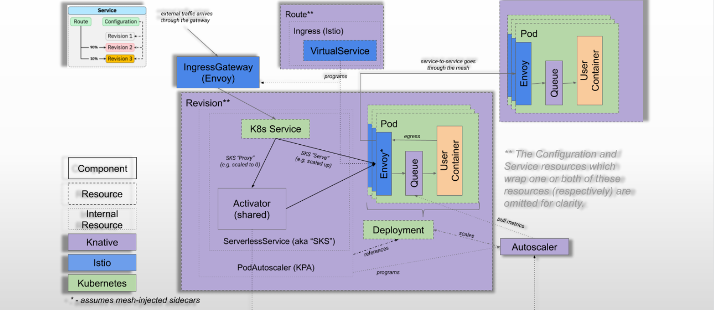
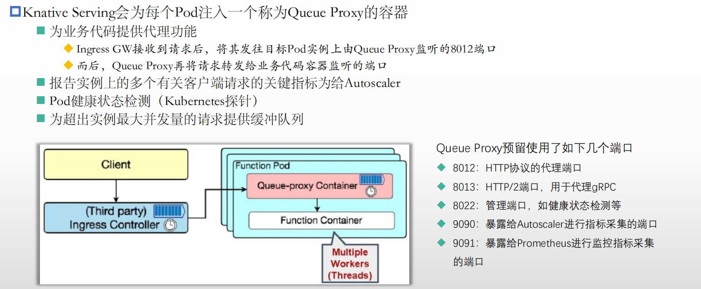
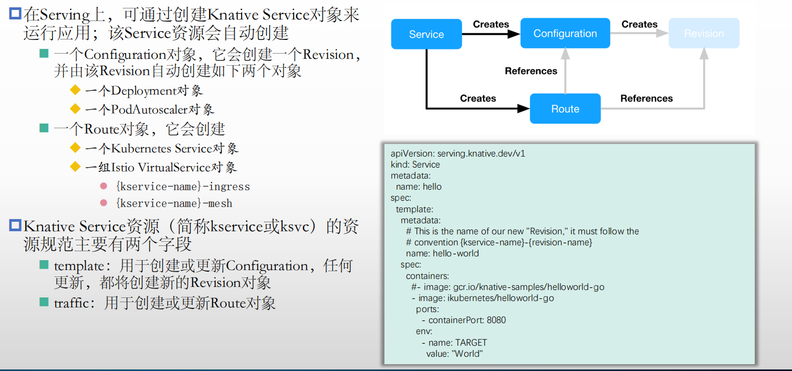

## 概述

消息路由，请求驱动（低频的不常用的应用规模缩小）

事件驱动：我们在ks8之上部署了有个kafka.不需要让客户端直接去订阅,knative为部署的kafka提供了一个再次封装的接口，从而做到了消息总线即服务的实现

Knative的组件：

1）Serving

◆部署、管理及扩展无状态应用

◆支持由请求驱动计算

◆支持缩容至0

◼Serving Controller 

◼Resources API

- Service
- Configuration
- Revision
- Route

2）Eventing

◆以声明的方式创建对事件源的订阅，并将事件路由到目标端点

◆事件订阅、传递和处理

◆基于pub/sub模型连接Knative的工作负载

◼Eventing Controller 

◼Resources API

- Broker
- Trigger
- EventType

3）Build

◆从源代码构建出应用镜像

◆已经由独立的**Tekton**项目取代

## Knative Serving架构

资源API定义在“serving.knative.dev”群组中

◼ Service

负责自动管理工作负载的整个生命周期

   ◆它能自动控制下面三个类型的资源对象的管理

◼ Configuration

   ◆生成各种期望项的配置，Service的更新也会导致Configuration的更新

◼ Revision

   ◆Service的次配置变更都有一个快照，每一次变更都会行成一个revision,但是每一个revison可以同时工作（金丝雀发布）

◼ Route（需要部署一个网络层组件，istio，其实是依赖于envoy的）

   ◆将请求流量路由到目标Revision

   ◆支持将流量按比例切分并路由到多个Revision

## Knative Eventing

把集群外部的事件源,通过一个声明式API(Source)转换为CloudEvents，可以定义多个source对应多个来源

## 部署

参见Knitive官网

注意：需要配置DNS，我们在创建kservice的时候，需要通过网关发布出去（istio的ingress gateway serviceIP ）但是有大量的kservice发布出去

外部的DNS解析域名

 Activator接收并缓存请求，同时报告Revison数量给Autoscaler,Autoscaler会根据每秒请求数（queue-proxy代理）自动缩放Revison上的Pod           

◼ **Webhook**：为Kubernetes提供的外置Admission Controller，兼具Validation和Mutation的功能，主要作用于Serving专有的几个API资源类型之上，以及相关的ConfigMap资源上；

◼ **Domain-mapping**：将指定的域名映射至Service、KService，甚至是Knative Route之上，从而使用自定义域名访问特定的服务；

◼ **Domainmapping-Webhook**：Domain-mapping专用的Admission Controller

◼ **net-certmanager-controller**：与Cert Manager协同时使用的专用的控制器；

◼ **net-istio-controller**：与Istio协同时使用的专用控制器

istio-ingressgateway必须有一个外网地址，以便于接入外部流量（可以使用节点地址加端口）

```shell
root@master01:~# kubectl   get svc  -n istio-system 
NAME                   TYPE           CLUSTER-IP      EXTERNAL-IP   PORT(S)                                      AGE
istio-ingressgateway   LoadBalancer   10.100.37.220   12.0.0.33    15021:30744/TCP,80:37951/TCP,443:58311/TCP   53m
istiod                 ClusterIP      10.100.170.42   <none>        15010/TCP,15012/TCP,443/TCP,15014/TCP        53m
编辑istio-ingressgateway增加externaIPs
```

## Serving及实践



客户端pod访问某一个服务端pod的时候，网格的来定义

knative可以和istio工作在同一个名称空间中，但是knative也有一个本地网网关可以使用

```shell
root@master01:~# kubectl  get svc   -n   istio-system 
NAME                    TYPE           CLUSTER-IP      EXTERNAL-IP   PORT(S)                                      AGE
istio-ingressgateway    LoadBalancer   10.100.37.220   12.0.0.30     15021:30744/TCP,80:37951/TCP,443:58311/TCP   5h29m
istiod                  ClusterIP      10.100.170.42   <none>        15010/TCP,15012/TCP,443/TCP,15014/TCP        5h29m
knative-local-gateway   ClusterIP      10.100.77.0     <none>        80/TCP                                       4h29m

```

### Queue Proxy



### 实例



```yaml
root@master01:~/knative/knative-in-practise-main/serving/basic# cat hello-world.yaml
apiVersion: serving.knative.dev/v1
kind: Service
metadata:
  name: hello
spec:
  template:
    metadata:
      # This is the name of our new "Revision," it must follow the convention {service-name}-{revision-name}
      name: hello-world
    spec:
      containers:
        #- image: gcr.io/knative-samples/helloworld-go
        - image: ikubernetes/helloworld-go
          ports:
            - containerPort: 8080
          env:
            - name: TARGET
              value: "World"
root@master01:~/knative/knative-in-practise-main/serving/basic# kubectl  get  pods   
NAME                                      READY   STATUS              RESTARTS        AGE
hello-world-deployment-85b77797cb-lgbdk   0/2     ContainerCreating   0               15s
root@master01:~/knative/knative-in-practise-main/serving/basic# kubectl  get  configurations   
NAME    LATESTCREATED   LATESTREADY   READY   REASON
hello   hello-world     hello-world   True    
root@master01:~/knative/knative-in-practise-main/serving/basic# kubectl  get  revision 
NAME          CONFIG NAME   K8S SERVICE NAME   GENERATION   READY   REASON   ACTUAL REPLICAS   DESIRED REPLICAS
hello-world   hello                            1            True             0                 0

```

