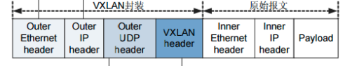
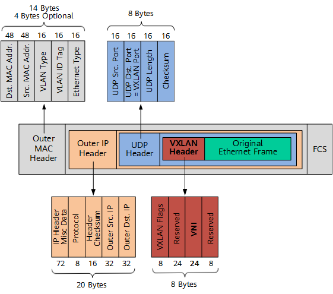
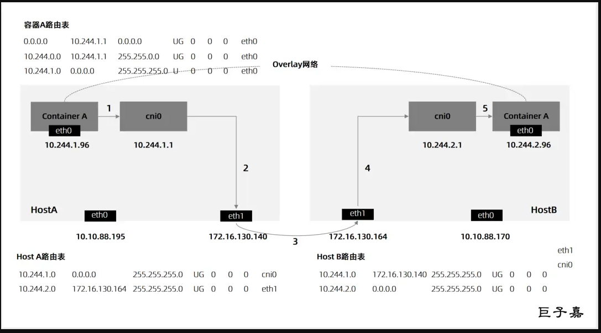

## HTTPS通信流程

第一步：客户端向服务端发起请求
（1）客户端生成随机数R1 发送给服务端；

（2）告诉服务端自己支持哪些加密算法；

第二步：服务器向客户端发送数字证书
（1）服务端生成随机数R2;

（2）从客户端支持的加密算法中选择一种双方都支持的加密算法（此算法用于后面的会话密钥生成）;

（3）服务端生成把证书、随机数R2、会话密钥生成算法，一同发给客户端;

第三步：客户端验证数字证书。
（1）验证证书的可靠性，先用CA的公钥解密被加密过后的证书,能解密则说明证书没有问题，然后通过证书里提供的摘要算法进行对数据进行摘要，然后通过自己生成的摘要与服务端发送的摘要比对。

（2）验证证书合法性，包括证书是否吊销、是否到期、域名是否匹配，通过后则进行后面的流程

（3）获得证书的公钥、会话密钥生成算法、随机数R2

（4）生成一个随机数R3。

（5）根据会话秘钥算法使用R1、R2、R3生成会话秘钥。

（6）用服务端证书的公钥加密随机数R3并发送给服务端。

第四步：服务器得到会话密钥
（1）服务器用私钥解密客户端发过来的随机数R3

（2）根据会话秘钥算法使用R1、R2、R3生成会话秘钥

第五步：客户端与服务端进行加密会话
（1）客户端发送加密数据给服务端

发送加密数据：客户端加密数据后发送给服务端。

（2）服务端响应客户端

解密接收数据：服务端用会话密钥解密客户端发送的数据；

加密响应数据：用会话密钥把响应的数据加密发送给客户端。

（3）客户端解密服务端响应的数据

解密数据：客户端用会话密钥解密响应数据；

## UDP

1）假设宿主机使用的网段是12.0.0.0/24

2）在宿主机建立的overlay neteork的网段是10.96.0.0/16

当我们使用flannel的时候，假设在Node上建立的一个overlay neteork的网段是10.96.0.0/16，每个Pod可以在这个网段中获取到其中的一个地址

并且flannel还给每个Node节点分配了一个flannel0网卡管理的地址段10.96.x.0/16,这个Node上创建的Pod会获取相应的PodIP，此Node上的docker0桥的地址是就是其中的地址（10.96.x.1/24），对于同一个Node上的Pod进行通信时就是走的这个docker0桥

3）假设现在有

node01(NodeIP=12.0.0.3/24,flannel0=10.96.3.0/16,docker0=10.96.3.1/24,PodIP=10.96.3.x/24)

node02(NodeIP=12.0.0.4/24,flannel0=10.96.4.0/16,docker0=10.96.4.1/24,PodIP=10.96.4.x/24)

node01上的Pod01=10.96.3.5要与node02上的Pod02=10.96.4.6进行通信，Pod01先要经过Node01上的docker0桥（是此节点上的所有pod的网关），其次这个PodIP还会被路由表所匹配，将其转发到flannel0这个dev设备，而这个flannel0设备对应的是一个flanneld守护进程，这个flannel会对数据包做目的地址转换，在overlay neteork网络中找到目标地址对应的物理地址（但是它是如何知道这个Pod所在的节点IP的?其实在etcd中会维护一种对应关系）。这样就会新增一个包头（src=12.0.0.3,dst=12.0.0.4）,然后再把这个新封装的包扔给内核，内核发现目标地址转为12.0.0.4:8285,转给node02.

node02收到这个数据包后（flanneld进程监听了UDP端口8252）去掉包头还原为（src=10.96.3.5,dst=10.96.4.6）,然后交给flannel0=10.96.4.0/16，再交给docker0桥

（在内核（kernel）里面，有两种虚拟网卡设备，分别是TUN和TAP,其中TAP处理的是第二层（数据链路层）的帧，而TUN处理的是第三层（网络层）的ip包。）

配置节点Pod使用特定的IP地址方法：

```js
cat /run/flannel/subnet.env 
FLANNEL_NETWORK=100.96.0.0/16 
FLANNEL_SUBNET=100.96.1.1/24 
FLANNEL_MTU=8973 FLANNEL_IPMASQ=true 
```

## VXLAN



1)原始L2帧的构建：

PodIP01=10.96.3.x/24

PodIP02=10.96.4.x/24

当pod01与pod02进行通信时，先查询路由表

[root@Node01 ~]# ip r
...
10.244.3.0/24 dev cni0 proto kernel scope link src 10.244.3.1 
10.244.4.0/24 via 10.244.4.0 dev flannel.1 onlink # Node2子网为10.224.4.0/24

被第二条规则所匹配，交给Node01_flabbel.1_MAC来处理，此时源为Node01_flabbel.1_MAC

再次查询ARP表

[root@Node01 ~]*# ip n | grep flannel.1* 

10.244.4.0 dev flannel.1 lladdr ba:74:f9:db:69:c1 PERMANENT ，此时就得到了下一跳10.244.4.0/24 的MAC地址

也就是目标MAC地址Node02_flabbel.1_MAC

（需要注意的是ARP表是由flanneld守护进程维护的）

这样就构造出了2层的以太网的帧

**Inner  MAC Header**                                                                                           **Inner IP Header**                               **Data**

Src MAC: Node01_flabbel.1_MAC  Dst MAC: Node02_flabbel.1_MAC        Src IP 10.96.3.x  Dst IP 10.96.4.x     ICMP

playload表示数据

IP header保存的是pod1和pod2的IP地址信息

Ethernet header不是pod1及pod2的MAC地址，而应该是**两端flannel.1的MAC地址**

2）Vxlan Header

Vxlan header这里只需要关注一个字段， 在目标node上的flannel.1上会对这个VNI字段进行check，看是否与自己的VNI一致，一致的话才会进行处理

3）UDP Header

从上图中的颜色可以看出, UDP是把整个Original Ethernet Frame及Vxlan Header都囊括在一起了，我们知道，udp header中包含有源端口，目的端口，如图所示



所以很自然Src.port为node1上的flannel.1的端口，该端口是根据封装的内部数据帧计算出的一个哈希值

Dst.port(上面也显示为VxlanPort)为node2上flannel.1的端口，Linux内核中默认为VXLAN分配的UDP监听端口为4789

4）Outer IP header

上面的信息其实还都是在flannel中, 上面说过任何虚拟出来的网络最终都是要经过实体网卡设备出去,目前封装出来的udp header是不能在宿主机网络中传递的，只能进一步把udp再封装成正常的网络包通过节点物理网络发送出去，根据tcp/ip协议，有了UDP header自然是需要封装在ip报文中，所以有IP Header

那么这个源/目的隧道终端{Node节点上的flannel.1就是vxlan的隧道终端（VXLAN Tunnel End Point, **VTEP**）}的IP 地址是如何获取的

源IP地址信息来自于 flannel.1网卡设置本身

[root@Node01 ~]# ip -d a show flannel.1

flannel.1: <BROADCAST,MULTICAST,UP,LOWER_UP> mtu 1450 qdisc noqueue state UNKNOWN group default
 link/ether 32:02:78:2f:02:cb brd ff:ff:ff:ff:ff:ff promiscuity 0
 vxlan id 1 local 12.0.0.3 dev eth0 srcport 0 0 dstport 8472 nolearning ageing 300 no

目的IP地址可根据fdb表查的，由flanneld维护

[root@Node01 ~]*# bridge fdb show | grep flannel.1* 

ba:74:f9:db:69:c1 dev flannel.1 dst 12.0.0.4 self permanent

{Fdb表保存了二层设备中MAC地址和端口的关联关系，在二层设备转发以太网帧时，就会根据这个表找到对应的端口，例如同一个节点的Pod就是通过fdb表，在cni0网桥上通信的}

5)Outer MAC Header

而ip header则又需要由封装在mac header中 MAC header 自然就是node的mac信息了

这样就完成了VXLAN UDP报文的封装，实现了一个所有Pod同属一个大二层网络的VXLAN网络模型

## HOST-GW



HOST-GW模式 属于路由的方式，无需经过任何 封包和解包 ，纯路由机制实现，因此性能比较高。但是 HOST-GW模式 只支持宿主机之间二层连接，要求集群中所以节点必须处于同一个网络中

HOST-GW模式 将目的主机当作网关，直接路由原始的数据包。flanneld会在集群节点上创建并维护路由表，当数据包到达集群节点的时，就会根据路由表直接发送到下一跳，也就是同网段的节点IP，直接通过二层网络将数据转发到目的节点上；目的节点再根据路由表规则转发到cni网桥，网桥根据路由规则转发到容器里面

## Linux Bridge

root@harbor02:~# ip l  a   br0 type bridge  
root@harbor02:~# ip l  s   bro   up

root@harbor02:~# brctl   show 
bridge name	                                             bridge id		                STP                              enabled	interfaces
br-c06d6772a75e		                                8000.02421114baad     no		                                          vetha3e9fe1

​                                                                                                                                                                         pod的虚拟网卡对的一端，另一端在容器内

br0		                                                         8000.000000000000	 no		
docker0		                                                 8000.024247953638	 no

创建两个名称空间		  

root@harbor02:~# ip netns  a ns1  
root@harbor02:~# ip netns  a ns2

再创建两个虚拟网卡对

root@harbor02:~# ip l a veth0-test type veth peer br0-veth0
root@harbor02:~# ip l a veth1-test type veth peer br0-veth1

把虚拟网卡对的一端放置在ns

root@harbor02:~# ip l s veth0-test netns ns1 

root@harbor02:~# ip l s veth1-test netns ns2

root@harbor02:~# ip  a

35: veth0@if36: <BROADCAST,MULTICAST> mtu 1500 qdisc noop state DOWN group default qlen 1000
    link/ether 0a:3c:19:ef:e9:de brd ff:ff:ff:ff:ff:ff link-netnsid 7
37: veth1@if38: <BROADCAST,MULTICAST> mtu 1500 qdisc noop state DOWN group default qlen 1000
    link/ether 02:1b:43:59:13:77 brd ff:ff:ff:ff:ff:ff link-netnsid 8

root@harbor02:~# ip netns exec ns1 ip a 
1: lo: <LOOPBACK> mtu 65536 qdisc noop state DOWN group default qlen 1000
    link/loopback 00:00:00:00:00:00 brd 00:00:00:00:00:00
36: veth0-test@if35: <BROADCAST,MULTICAST> mtu 1500 qdisc noop state DOWN group default qlen 1000
    link/ether be:1d:6e:5e:f7:a5 brd ff:ff:ff:ff:ff:ff link-netnsid 0

再将网卡的另一端放在br0桥

root@harbor02:~# ip  l  s  veth0 master   br0  
root@harbor02:~# ip  l  s  veth1 master   br0  

root@harbor02:~# brctl  show 
bridge name	bridge id		                          STP enabled	interfaces

br0		8000.021b43591377	                       no		                 veth0
							                                                                               veth1	  此时bro0桥上就有了两个接口

root@harbor02:~# ip  l s  veth0  up  
root@harbor02:~# ip  l s  veth1  up  

分别将ns中的网卡启动，并配置IP地址

root@harbor02:~# ip netns exec ns1  ip  l s  veth0-test  up 
root@harbor02:~# ip netns exec ns2  ip  l s  veth1-test  up 

root@harbor02:~# ip netns exec  ns1  bash 
root@harbor02:~# ifconfig                                                                  网卡被分配了MAC地址
veth0-test: flags=4099<UP,BROADCAST,MULTICAST>  mtu 1500
        ether be:1d:6e:5e:f7:a5  txqueuelen 1000  (Ethernet)
        RX packets 0  bytes 0 (0.0 B)
        RX errors 0  dropped 0  overruns 0  frame 0
        TX packets 0  bytes 0 (0.0 B)
        TX errors 0  dropped 0 overruns 0  carrier 0  collisions 0

root@harbor02:~# ifconfig    veth0-test  192.168.1.61/24    
root@harbor02:~# ifconfig 
veth0-test: flags=4099<UP,BROADCAST,MULTICAST>  mtu 1500
        inet 192.168.1.61  netmask 255.255.255.0  broadcast 192.168.1.255
        ether be:1d:6e:5e:f7:a5  txqueuelen 1000  (Ethernet)
        RX packets 0  bytes 0 (0.0 B)
        RX errors 0  dropped 0  overruns 0  frame 0
        TX packets 0  bytes 0 (0.0 B)
        TX errors 0  dropped 0 overruns 0  carrier 0  collisions 0

root@harbor02:~# ip netns exec  ns2  bash 

root@harbor02:~# ip a  a   192.168.1.62/24   dev   veth1-test  
root@harbor02:~# ifconfig 
veth1-test: flags=4099<UP,BROADCAST,MULTICAST>  mtu 1500
        inet 192.168.1.62  netmask 255.255.255.0  broadcast 0.0.0.0
        ether 4e:f8:11:74:f6:0b  txqueuelen 1000  (Ethernet)
        RX packets 0  bytes 0 (0.0 B)
        RX errors 0  dropped 0  overruns 0  frame 0
        TX packets 0  bytes 0 (0.0 B)
        TX errors 0  dropped 0 overruns 0  carrier 0  collisions 0

root@harbor02:~# ifconfig   lo up 
root@harbor02:~# ping     192.168.1.62
PING 192.168.1.62 (192.168.1.62) 56(84) bytes of data.
64 bytes from 192.168.1.62: icmp_seq=1 ttl=64 time=0.024 ms
64 bytes from 192.168.1.62: icmp_seq=2 ttl=64 time=0.033 ms
64 bytes from 192.168.1.62: icmp_seq=3 ttl=64 time=0.027 ms
^C

root@harbor02:~# ping    192.168.1.62                 此时ns1ping测ns2是不通的    

PING 192.168.1.62 (192.168.1.62) 56(84) bytes of data.
From 192.168.1.61 icmp_seq=1 Destination Host Unreachable
From 192.168.1.61 icmp_seq=2 Destination Host Unreachable
From 192.168.1.61 icmp_seq=3 Destination Host Unreachable
^C
--- 192.168.1.62 ping statistics ---
5 packets transmitted, 0 received, +3 errors, 100% packet loss, time 4076ms
pipe 4

root@harbor02:~# tcpdump -pne -i veth0

15:28:03.379082 be:1d:6e:5e:f7:a5 > 4e:f8:11:74:f6:0b, ethertype IPv4 (0x0800), length 98: 192.168.1.61 > 192.168.1.62: ICMP echo request, id 63064, seq 379, length 64
15:28:04.370553 be:1d:6e:5e:f7:a5 > 4e:f8:11:74:f6:0b, ethertype ARP (0x0806), length 42: Request who-has 192.168.1.62 tell 192.168.1.61, length 28
15:28:04.370599 4e:f8:11:74:f6:0b > be:1d:6e:5e:f7:a5, ethertype ARP (0x0806), length 42: Reply 192.168.1.62 is-at 4e:f8:11:74:f6:0b, length 28
15:28:04.403057 be:1d:6e:5e:f7:a5 > 4e:f8:11:74:f6:0b, ethertype IPv4 (0x0800), length 98: 192.168.1.61 > 192.168.1.62: ICMP echo request, id 63064, seq 380, length 64
15:28:05.427108 be:1d:6e:5e:f7:a5 > 4e:f8:11:74:f6:0b, ethertype IPv4 (0x0800), length 98: 192.168.1.61 > 192.168.1.62: ICMP echo request, id 63064, seq 381, length 64
15:28:06.450982 be:1d:6e:5e:f7:a5 > 4e:f8:11:74:f6:0b, ethertype IPv4 (0x0800), length 98: 192.168.1.61 > 192.168.1.62: ICMP echo request, id 63064, seq 382, length 64
15:28:07.474962 be:1d:6e:5e:f7:a5 > 4e:f8:11:74:f6:0b, ethertype IPv4 (0x0800), length 98: 192.168.1.61 > 192.168.1.62: ICMP echo request, id 63064, seq 383, length 64

抓包分析发现ns1的ARP请求（who-has 192.168.1.62）,并且192.168.1.62有了应答（我的MAC地址是xxx）,但是这个应答没有到达veth0，被br0桥drop掉了

root@harbor02:~# iptables -A FORWARD -i br0  -j ACCEPT

